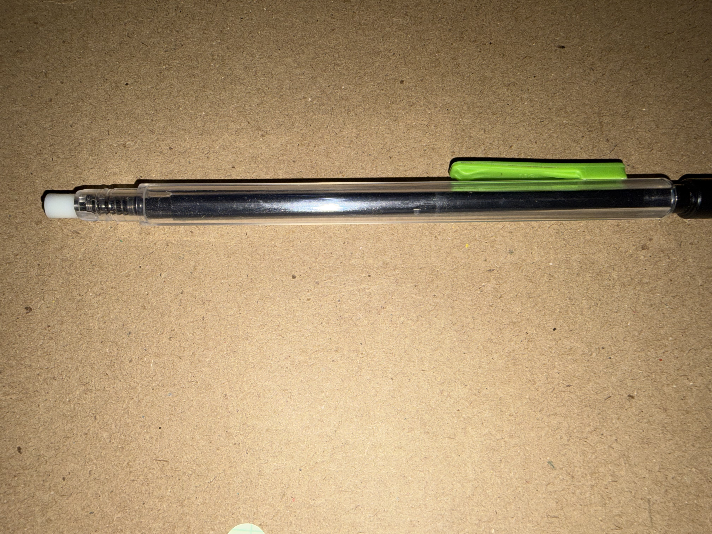
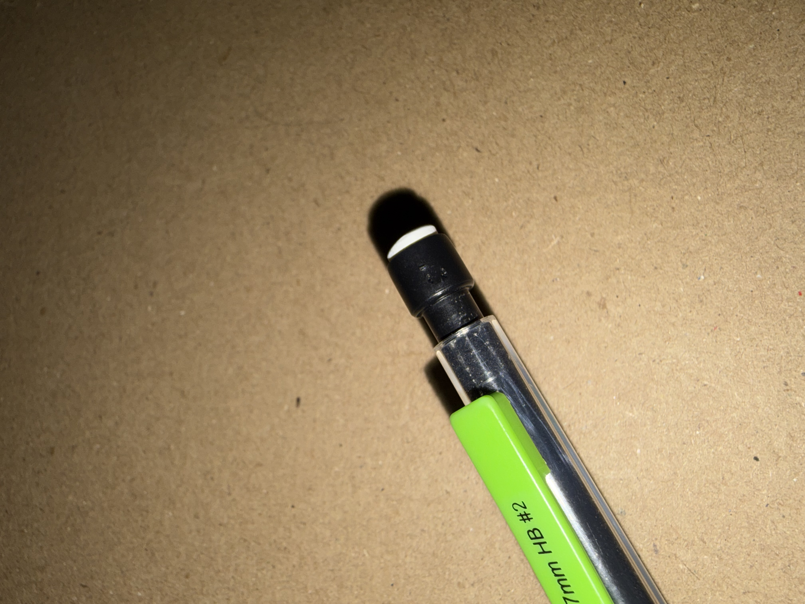
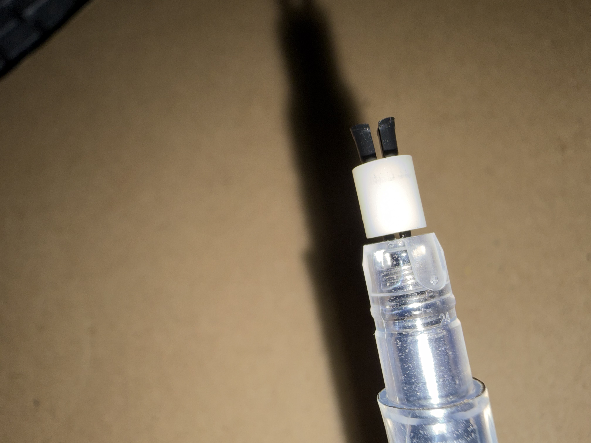
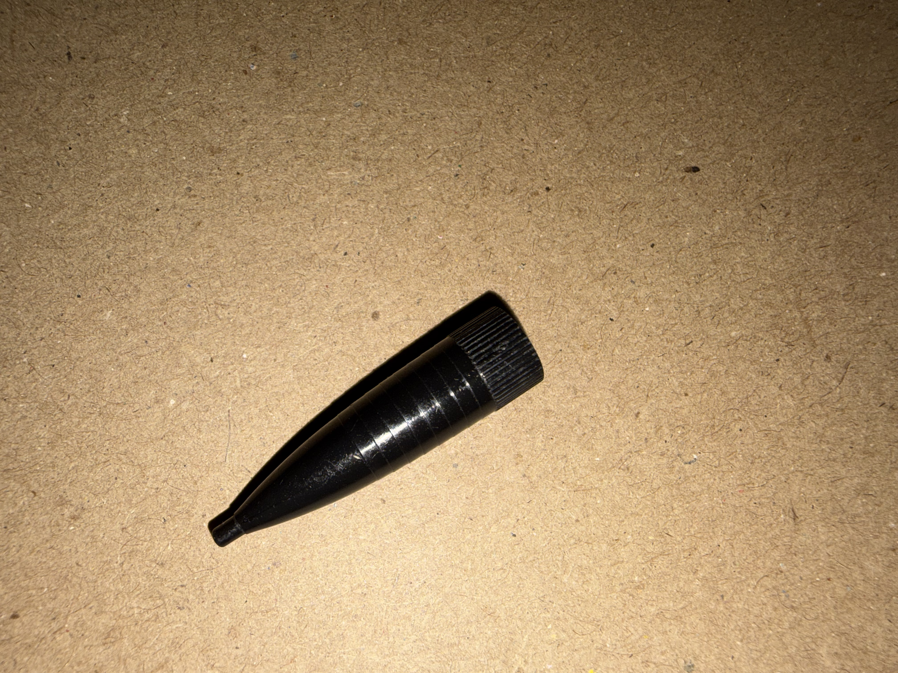
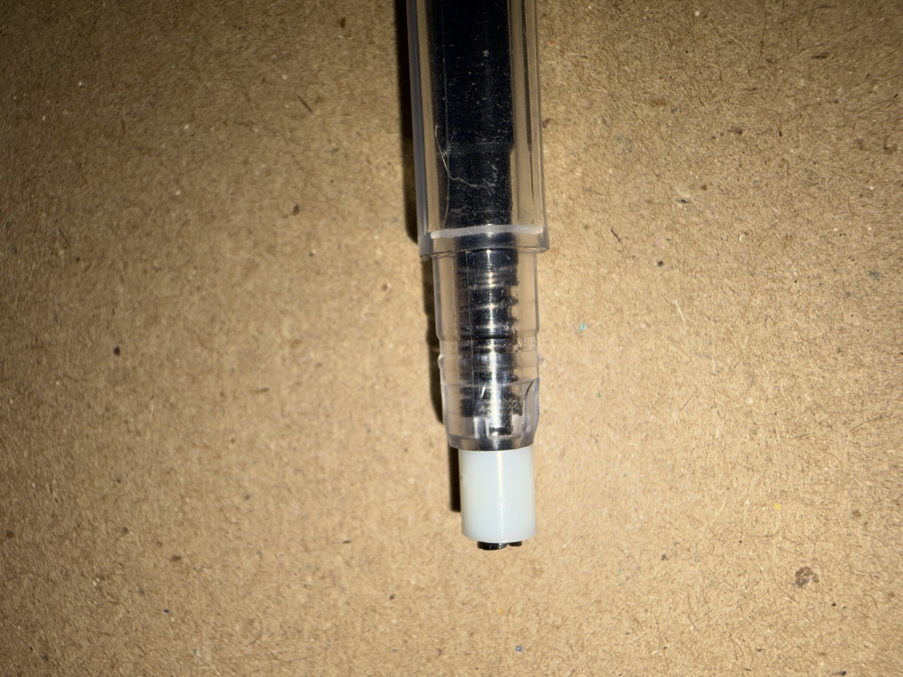

# A1 – Build Your Professional Portfolio

## Objective
- Demonstrate engineering competency and professionalism through portfolio and product analysis, portfolio creation, and professional reflection.

## Analyze
**Portfolio Analysis**  
Portfolio 1 - 
- Source : https://nhoong.github.io/ &nbsp;&nbsp;&nbsp; (Engineering Portfolio: Nathan Hoong)  
&nbsp;&nbsp;&nbsp;&nbsp; The first portfolio displays excellent readability and quick navigation, as it presents as a showcase on the main page of the website. Immediately, the reader is met with a introduction description of Hoong's expertise where he displays proficiency and experience in Mechanical engineering. This description is specific to his educational and professional strengths, and highlights his confidence in his ability while remaining concise. Within seconds the rest of the portfolio presents with the documentation of his projects and designs. Each have the same level of precision and ease of navigation to each one individually. Underneath individual projects, one can see a short description of the objective and result of each project, demonstrating a variety of tools used and skills showcased. Although this maintains the ease of reading of the introduction, the descriptions doesn't provide detailed reasoning, so the reader could not easily reproduce the projects easily without more details outside of this page. in addition to improve the clarity of the project display for the user, one of the projects requires maintenance as it isn't displaying correctly.

Portfolio 2 - 
- Source : https://fwachter.github.io/ &nbsp;&nbsp;&nbsp; (Frederick Wachter)  
&nbsp;&nbsp;&nbsp;&nbsp; The second portfolio is easily navigated through buttons at the bottom of the website bringing the reader to quick displays of information detailing Wachter's engineering and project experience or contact information. Within the second page, Wachter gives an overview of the skills and proficiency gained from his educational and work experiences. Following that About Me page, readers will find the platforms worked, specific engineering and project experience, and contact information. These details make the portfolio employer ready while allowing quick navigation to individual projects. Although each project only has a smaller description detailing the end result, most of them have links to access further information on the reasoning, goals, and the information valuable to reproduction. To improve this portfolio further, another system could be used for navigation, as revealing each individual project and going to separate pages pushes the portfolio navigation past the 60 second ideal.

**Product Analysis**
- Source: https://patents.google.com/patent/US9340061B2/en
*Primary Function:*&nbsp;&nbsp; The mechanical pencil receives lead through a shifting reservoir held by a spring within the main barrel which is connected to a push button mechanism allowing lead to pass through the chuck when pushed and grips the lead in its new position, via the tightening ring, while resetting the reservoir when released.

*Governing Principles:*  
&nbsp;&nbsp;&nbsp;The driving forces of the mechanisms behind this pencil are the concepts of pushing force, Hooke's Law, and frictional force. To initiate the lead advancement mechanism, users must input a pushing force to the button attached to the end of the barrel, typically fitted with a removable eraser. In other words, overall initiation of product use relies on Newton's Second (F-net = ma) and Third laws to cause motion and reaction of the force within the barrel triggering reservoir and chuck shifting; both laws assuming all parts to be rigid. In the Second law, F-net is the total force, m is the mass, and a is acceleration. This motion causes the tightening ring to shift downward with the chuck, before shifting upward, releasing its hold on the lead.
&nbsp;&nbsp;&nbsp;In this shifting of force, the spring at the bottom of the reservoir is displaced, using Hooke's Law (F = -kx). Within this law, F is the restoring force that will re-expand the spring, k is the spring constant, and x is the displacement. This re-expansion shifts the reservoir, chuck, and button back into original placement after usage. The mechanism assumes the spring compresses linearly with the user's force.
&nbsp;&nbsp;&nbsp; Once lead is in place, while the button is pushed, the shift of the clutch jaws downward advance lead towards the tip and then release lead entirely. Once released the tightening ring shuts the clutch around the lead in its new position. This grip relies on Static Friction (F = μ N) to avoid lead damage and hold it in place. In this equation, F = static friction force, μ = coefficient of static friction, and N = normal force. This assumes lead is being restricted primarily by this force.

*Mechanical Component Breakdown*  
  
**Barrel and Reservoir:**  
  
&nbsp;&nbsp;&nbsp;
The barrel allows the user to grip onto the pencil while the more narrow and tapered reservoir sits within it. The diameter difference allows the reservoir to shift within the barrel without contacting the walls, preventing unnecessary friction. Instilling a tapered end, towards the tip component of the pencil, allows the lead to follow a path towards the chuck when the button mechanism is used.  
  
**Push Button**  
  
&nbsp;&nbsp;&nbsp;
The push button is fixed onto the reservoir with a nearly equivalent external diameter to the barrel, creating a barrier for the force applied to it, and limiting the consequential motion caused by it. The hollow shape fitted with the eraser functions as the channel for the input of lead into the reservoir and the eraser acts as the seal to it. At the point of attachment of button to reservoir, the internal diameter is made to match that of the chamber. This specific geometry is necessary to ensure the tightening ring and chuck remain contained within the tip through motion while still allowing surface area for applied force to drive internal mechanisms and access to the reservoir.  After initial introduction of lead, the button must be pushed to allow it to enter the chuck.
**Tightening Ring & Chuck**  
  
&nbsp;&nbsp;&nbsp;
The chuck is a tapered bisected piece of plastic with a hole connecting to the reservoir held tight by the tightening ring that surrounds it and is held on by the chucks flared rim . The taper transitions the internal components function from storage to lead isolation and advancement. When the button is released, the tightening ring constricts the plastic, using friction to prevent the lead from slipping. The ring is dimensioned to catch before the very tip of the pencil, allowing the chuck to split at the bisection, and releasing the lead so it may advance. When the button is pushed, the ring and chuck shift together towards the end of the tip component, where the diameter dimension of the ring will align eventually with that of the tip, catching, and allowing the chuck to split at the bisection. This releases the lead so it may advance.

**Tip**  
  
&nbsp;&nbsp;&nbsp;
The tip is a cone shaped plastic piece which acts as the source of output lead and the mechanism to allow the chuck to open. This cone shape allows the diameter to shrink until reaching the diameter of the lead, giving the tightening ring a surface of resistance. The extension of this smaller diameter at the end provides structural stability to the lead as the pencil is in use.  
  
**Spring**  
  
&nbsp;&nbsp;&nbsp;
The spring is held within the barrel, surrounding the chuck just below the tightening ring. This helix structure allows compression and expansion that translates the external force applied to internal component motion.  
  
*Patent Details:*
**Inventor:** Franck Rolion, Ludovic Fagu
**Patent Number:** US9340061B2  
  
*Alternative Suggestions*  
1) Alternative button position. To allow for more functionality in the eraser, while allowing an input of force, the push button could be moved to one of the barrel side walls.  
2) Alternative lead advancement mechanism. To drive lead towards tip a screw mechanism could be instilled replacing the push button and spring.

*Original Design Decision*
The inventor used a more flexible plastic for the chuck mechanism than seen throughout the rest of the design. The driving force behind this seems to be the prevention of failure with constant motion of the bisected parts and force of the tightening ring.

## Decide  
  
**Homepage Identity**  
  
For my homepage, I prioritized showcasing my education and expert level product displays from engineering inspirations of mine with quick access to different portions of the About Me page. Under this quick access hub, I've set links to navigate directly to my personal description, projects, and contact information. This is to create ease of use to users who want to know my specific realms of proficiency and prevent lost sections as that page grows in the future.  

**Intentional Customization**  
  
One of the intentional customizations I made was to adjust the color scheme of the site. In my About Me description, I detail my interest in the connection between beauty and functionality. Adjusting the color scheme to Indigo was a way of using a small detail to showcase that while keeping the contrast high enough to keep information readable.  
  
**Documentation Standard**   

> *I intend to document all assignments as a future employer may expect: meeting the set objectives and returning work in an organized, clear to read manner.*  

## Communicate  

**Hi,** my name is Saniyah Wilson and I am a third-year Mechanical Engineering Major at UNC Charlotte.   
  
Growing up, I moved up and down the East coast, developing a deep appreciation for the systems that allowed the environments around me to hold beauty and efficiency at once. Involved with both arts and music, I pursued personal curiosities about my own items, interested in identifying the processes behind the creation. I found that in each step the parts are catered to heighten the users experience, similar to how an artist considers their audience.
  
Specifying this interest to investigate product and entertainment product design, specifically, has remained constant throughout my life, which has motivated my aspirations in Mechanical Engineering. 
  
My Associates in both Engineering and Science, received in 2026, have provided me competency in successful teamwork, detailed and efficient communication, and key conceptual proficiency in the Calculus-based mathematics and physics necessary within the field. Courses such as Geology 1 and Intro to Ethics provided unique insight to the human and Earthly consideration necessary in Engineering. Over the course of my education, I have demonstrated an agile ability to receive new data, identify and implement the correct problem solving strategy, as well as document the process. From this, I am proud to have earned the Certified SolidWorks Associate certificate. Using this platform, I gained proficiency in part modeling including intermediate feature use, assembly, and drawing file use. I look forward to applying these skills on larger professional projects.  
  
**What does it mean to defend an engineering decision: and do you currently know how to do it?**
  
In these professional settings, it is important that each engineering decision is justified and reviewed by many points of authority before it is executed and released. At this point in my career, this is a skill I am still building. For now, I work from a framework of prioritizing ethics and accuracy when considering a decision.   

**Time Tracked**
  
In total, I spent around 11-12 hours on this assignment. 
  
