# A2 – Truss Stress Analysis

## Objective  
- Design a lightweight planar truss using A500 steel or an alternative material.  
- Create free body diagrams (FBDs) for joints and critical pins.  
- Calculate the required cross-sectional area of truss elements with a safety factor.  
- Determine pin sizes based on shear forces with a safety factor.  
- Solve equations symbolically and numerically for both truss and pin design.  
- Estimate the total weight of the truss and pins.  
- Create a CAD model with accurate dimensions and connections.  
- Compare CAD weight predictions with hand calculations.  
- Document key engineering lessons learned from the process.  
  
  
## Analyze  
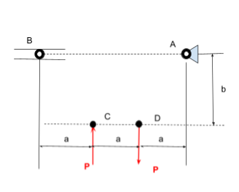
  
To design within the design constraints of this assignment, first I considered how the geometry of the structure could be simplified. For my design, I prioritized the use of right triangles to allow the Pythagorean theorem to be valid for analysis. To determine the structure would hold it's stability I used the stability joint equation provided in the SoDesign Course Materials. (2*[number of joints] = 3 + [number of members]) For these specific design constraints, a stable truss requires 8 members, providing the limits needed to finalize my design. To fully comprehend the requirements of this design, the minimum surface area and weights of all elements, including beams and pins must be found.  

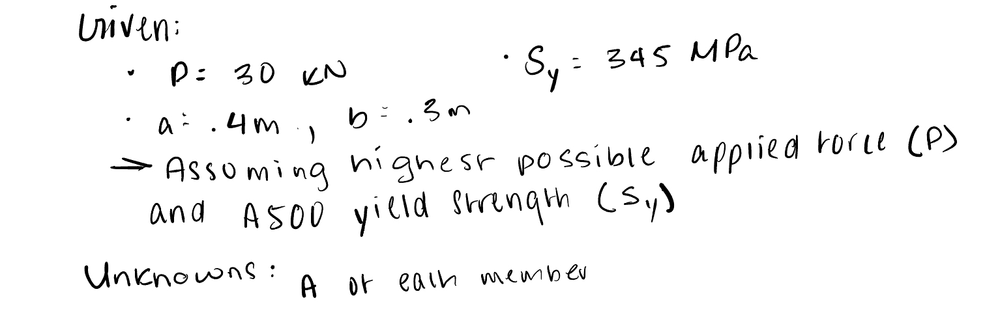

To find these values, I first determined the unknowns and knowns. It's within this process that I chose the highest minimum applied force (P = 30 KN). Because of this I chose the highest minimum magnitude for yield strength of A500 Steel throughout analysis. First, the truss was treated as a whole using the Moment equilibrium equations to determine the magnitude of the support at B. For the rest of the statics analysis, the method of joints was used to both algebraically, notated in black, and then numerically solve the internal forces found throughout the truss, notated in blue. These color notations continue throughout the documentation for clarity.   

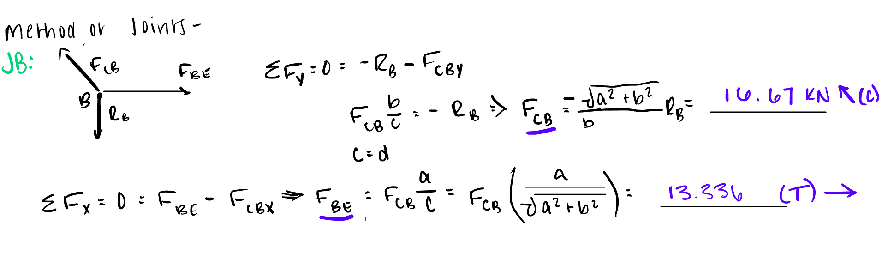
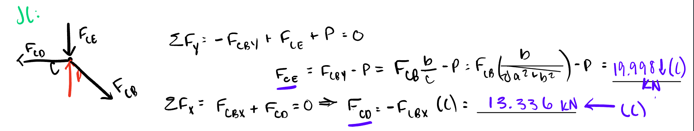
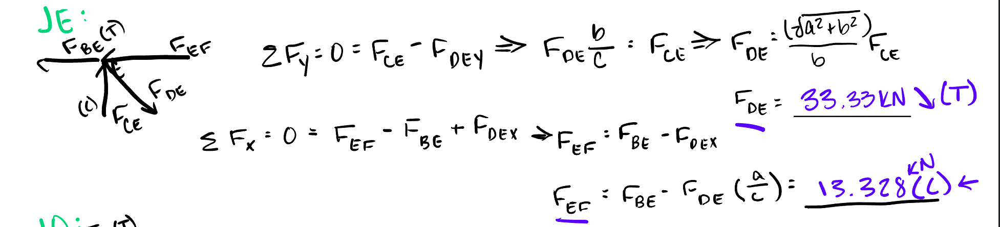
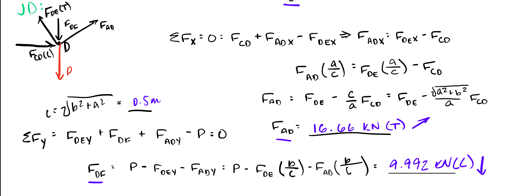
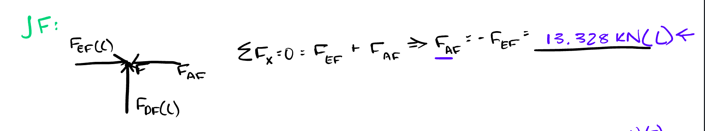
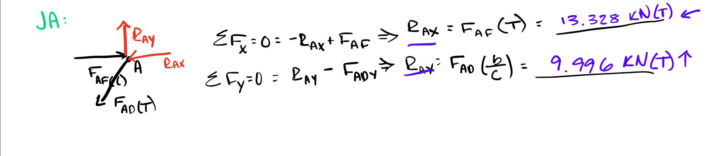

  
Once the maximum internal force was determined, found to be Force DE, the safety factor and yield strength of the A500 steel can be used to find the minimum surface area of each beam. After identifying given and needed information, I sketched a generalized Stress-Strain graph to visualize the specific goals of this objective. Then using the relationships between stress, yield, and area, the minimum area was found algebraically and numerically.  
   
   

<insert beam weight work>
To find the weight of the beams I considered as far as points were separated a single beam and paired equivalent beams together for calculation for efficiency. Once the length restraints were converted for calculation the weights for members AB, EC and DF, BC and AD, and CD were found using the that minimum area restriction. Here, most notation is presented in black, as algebraical and numerical solving happened simultaneously.  

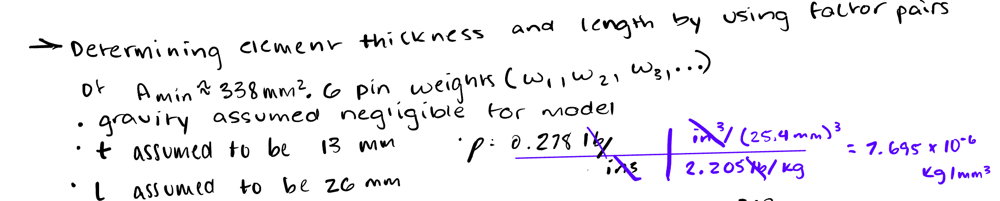
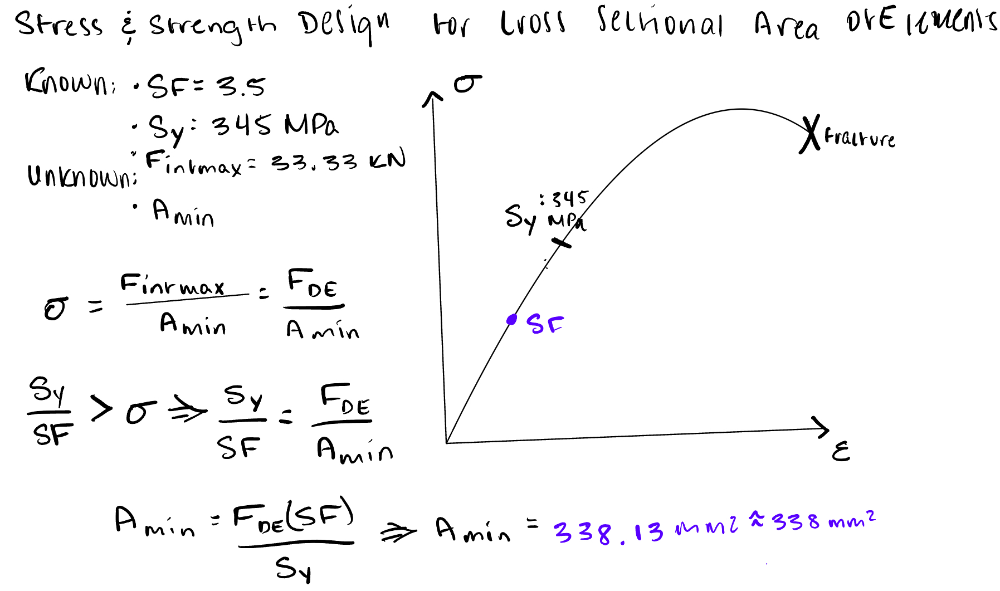

To finish the analysis process, the minimum surface area of each pin must be found. In this design, each beam is a rectangular prism while the pins themselves are represented by cylinders representing single shear connections. It is assumed in this analysis that there is no compression failure through buckling. 

  

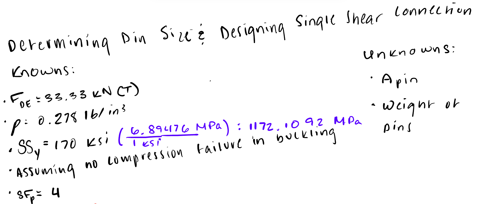

I specifically analyzed off of Pin D to ensure the largest internal force passed through. The provided density and shear strength of the pins is converted to the metric system through analysis to remain consistent in both calculations and modeling. Then the relationships between shear stress, yield shear strength, and the density of the pins was used to determine the minimum surface area.  

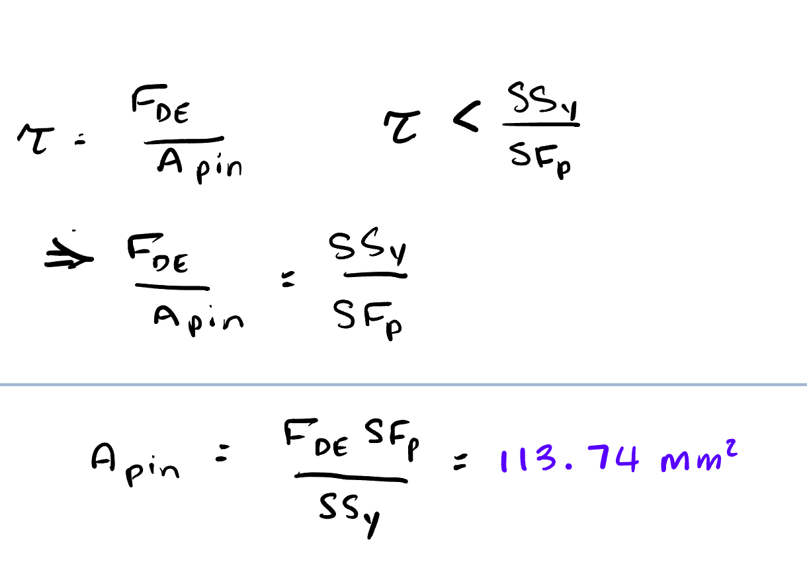
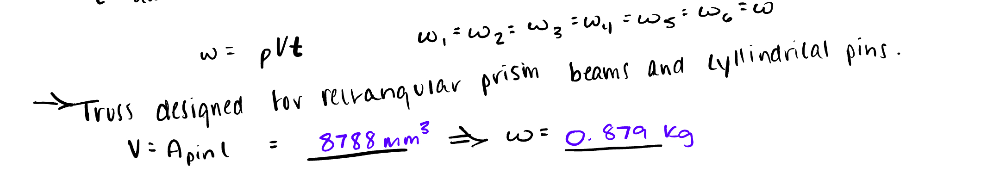

**Analysis Resources:*  

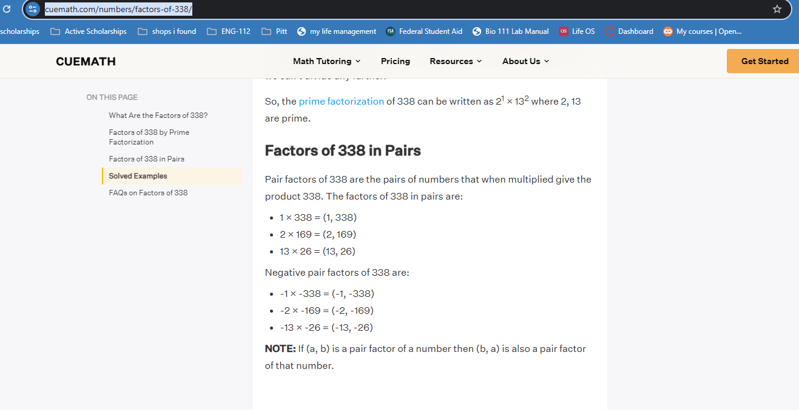  
  
- https://beamdimensions.com/materials/Steel/ASTM/ASTM_A500/#Grade_C
- https://www.cuemath.com/numbers/factors-of-338/ 

To model this truss design, I created a single part within SolidWorks. Before creating solid lines, I created the shape of the truss I designed within the dimension constraints provided using the centerlines. This gave the sketch a continual point of reference for the midpoints of the beams which lay perpendicular to each other. I began with the bottom horizontal beam as the base for my sketch, on the right plane. Once this beam was extruded, the top exposed surface served as the sketch plane for the two vertical beams available. 
  
  

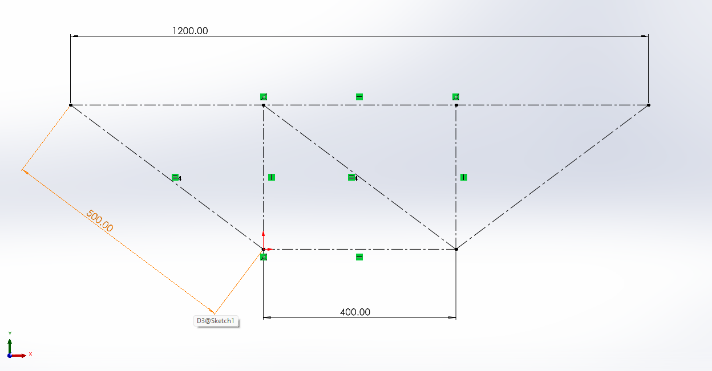  
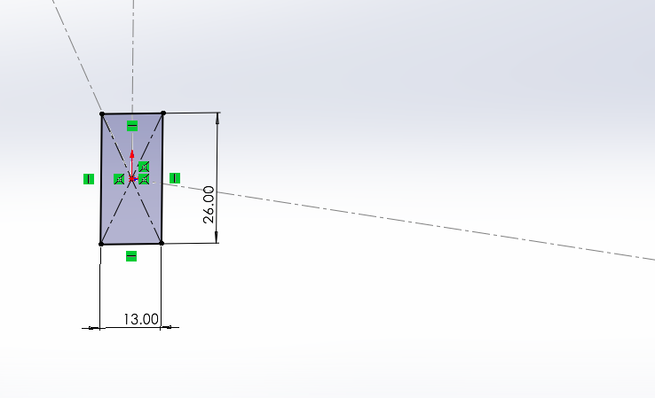  
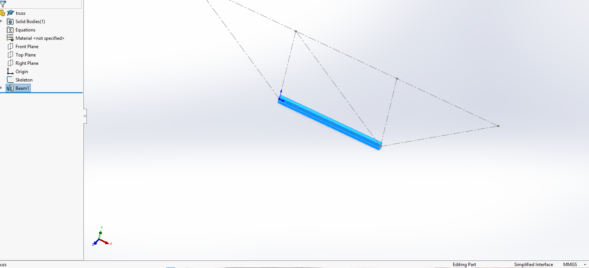  
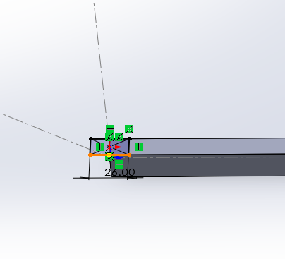  
  

  
The top surfaces of these vertical beams served as the sketch surface for the larger horizontal truss which sets on top. With the first four beams modeled, the challenge was to connect them in a ready position to be pinned. To accomplish this, different arrangements of relations between lines of the diagonal beams and the rest of the truss were experimented with. Ultimately the best arrangement consisted of perpendicularity to one point of the skeleton and horizontality to the other.  

 
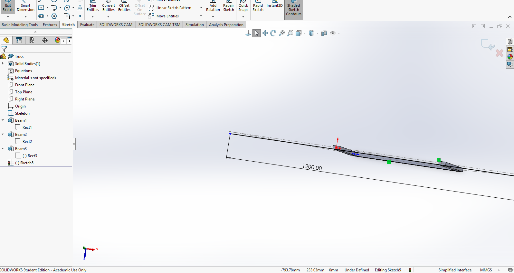  
  
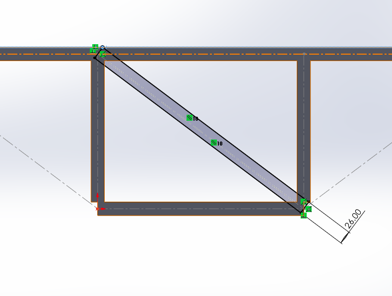  
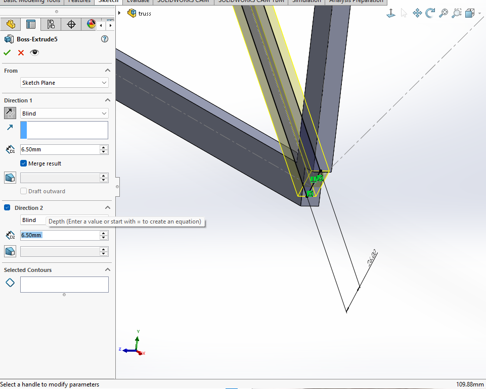  

This pattern was solution was implemented for the other two diagonal beams, completing the stable truss design. To determine the size of the holes needed for the pin, based off of found minimum pin area, I used SensorOne's online Area to Length calculator, which can be found in resources below. Once found I created extruded cuts at all intersections of the beams and created a matching dimensioned cylindrical pin in another part file. Within an assembly file, these parts were fitted to represent the true state the truss would exist in. I chose to wait to change any density values until the end, where I adjusted the material to A36 Steel, as the originally planned A500 material was not available with the CAD platform. After this, I was able to run and collect the weight analysis on the design, provided below as well.

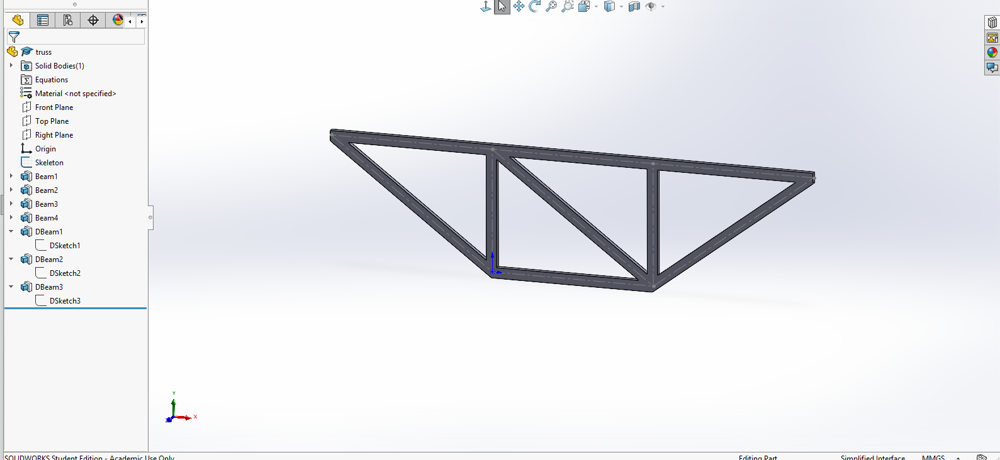 

**View Model Here!** [ https://drive.google.com/drive/folders/1a5Zx1QCKdAGShUvQn9if_SUfI2M6UP7H?usp=sharing](https://drive.google.com/file/d/14ApEUJGHnBGMmO7gC-bbwo_vISWYs3HZ/view?usp=sharing) 

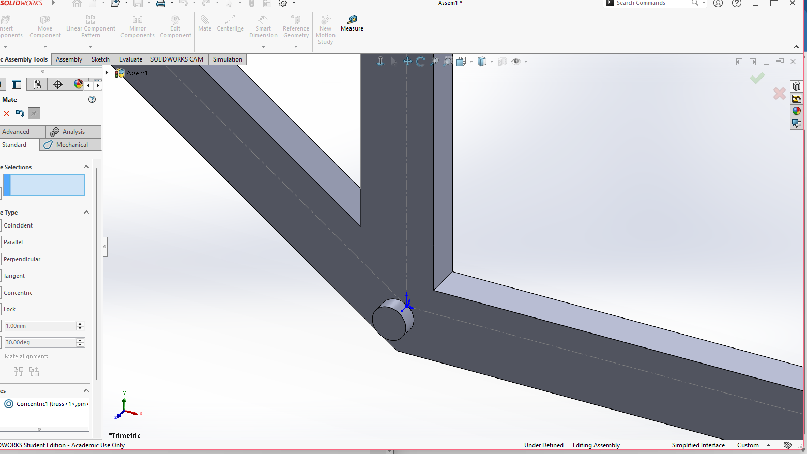
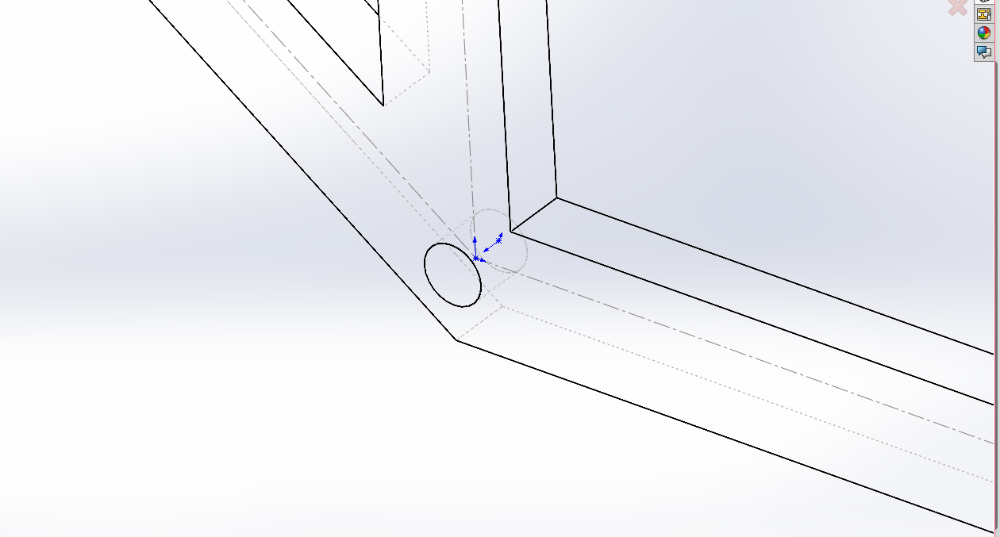
  

  
**Additional Resources:**
- https://www.sensorsone.com/circle-area-to-diameter-calculator/

  
## Decide  

The geometry of this design was chosen to ensure stability while limiting each area to be equivalent with one another. To meet those constraints, all triangles were made to be at 90 degree angles allowing the Pythagorean theorem and trigonometric identities to be used. These trigonometric identities were key to solving the various internal forces seamless without overspending time calculating specific potential angles between beams. The specific arrangement of these triangles has come about by chance and does not limit this particular design, so it was not considered.   

  
  
## Communicate

