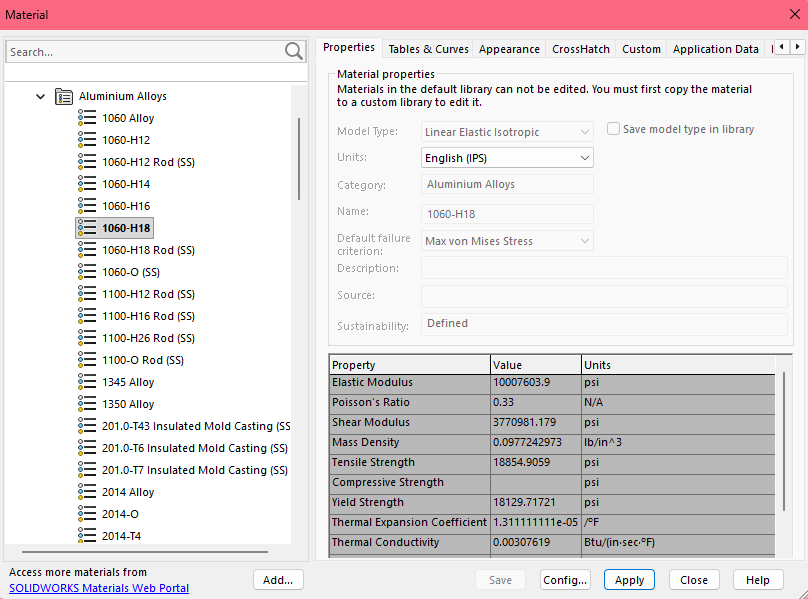
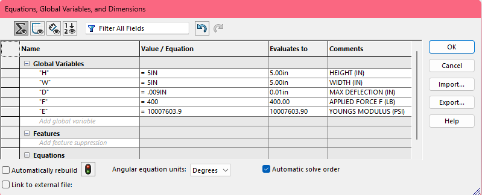
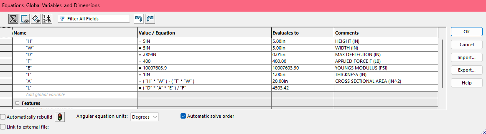
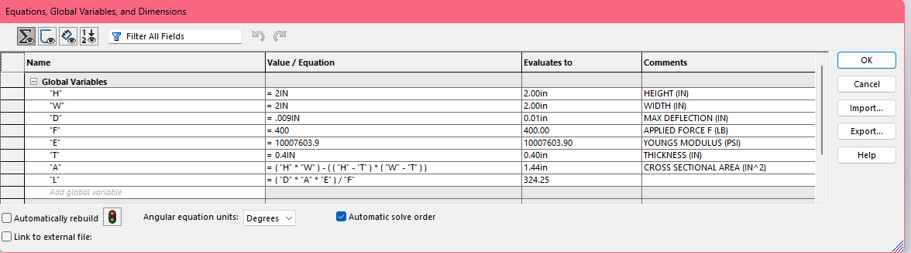
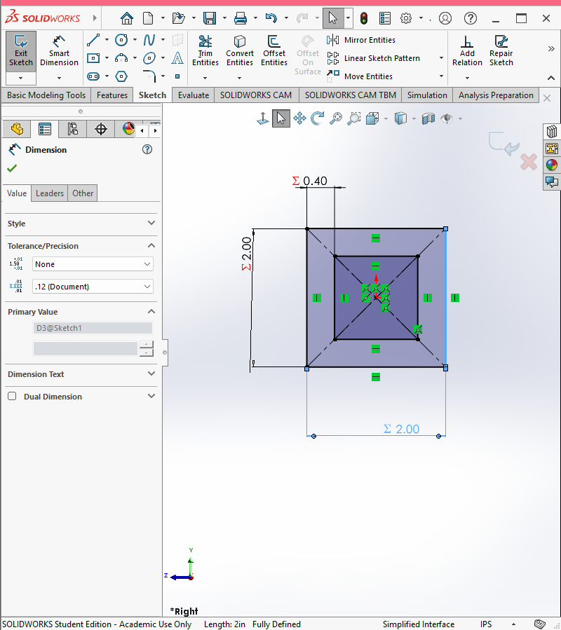
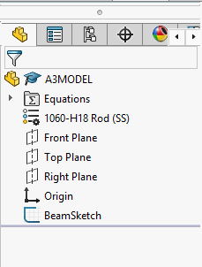
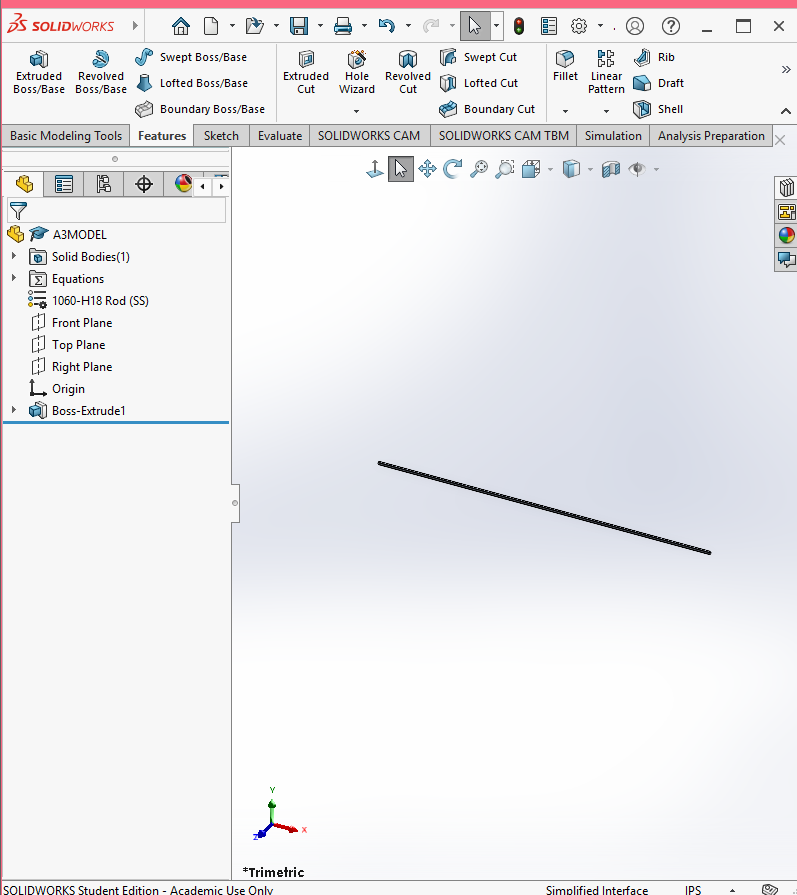
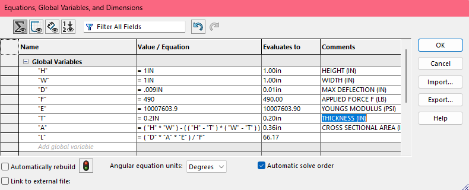
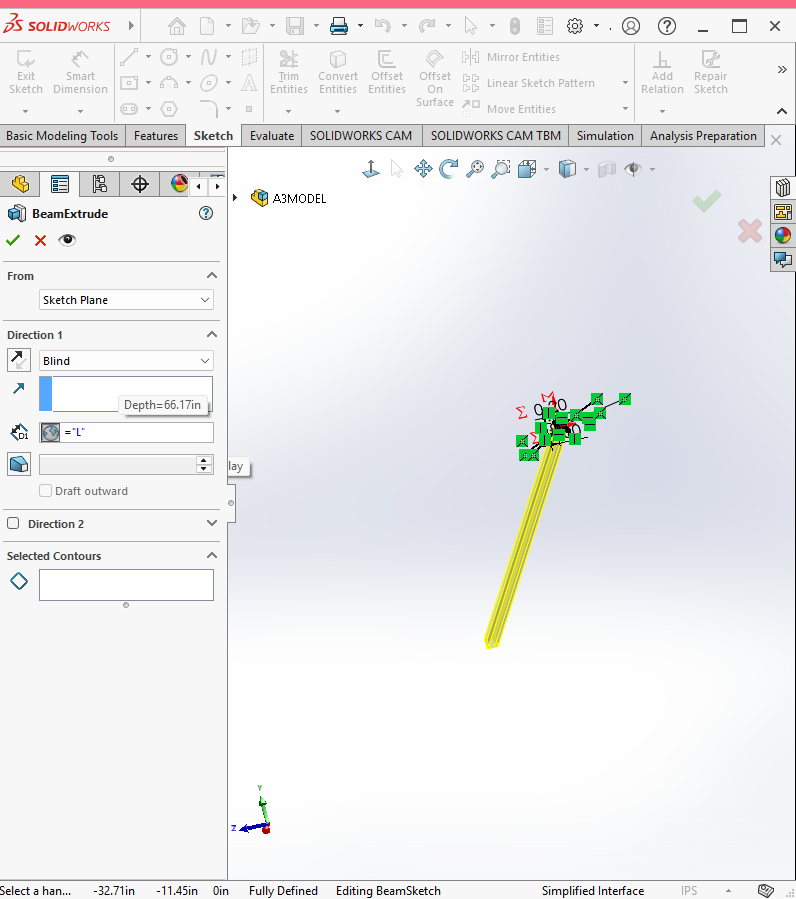
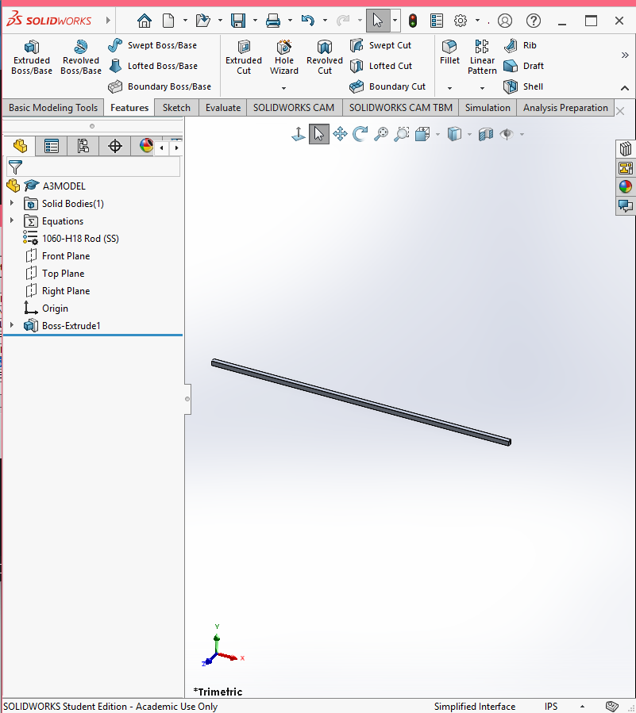

# A3 – Parametric and FEA

## Objective   
  
- Use axial deflection modeling to design its dimensions  
- Use parametric design to determine a bars length  
- Introduce you to FEA (Finite Element Analysis)  
- Introduce you to linking dimensions to appropriate parameters in CAD.  
- Compare and contrast the different analysis  
  
## Parametric Design  

To model a hollow cantilever beam, first, I chose an Aluminum material from the Solidworks Materials Database with a Young's Modulus between the parameter of (8.5 - 11.5) x 106 psi.     
  
  
   
*Shown Above: 1060-H18 Aluminum Rod (SS) with Young's Modulus 10007603.9 psi.*   

   
To determine the length of the structure, I chose and assigned the necessary values for the direct tension elongation equation and given values to variables within the Equation Document Properties of my sketch. Initially, the applied force (F) was chosen to be 400 lbf, height (H) to be 5.0 in, and width (W) to be 5.0 in.  
    
    

      
After choosing the thickness (T) to be 1 in, the global variables were used to assign variables for area and length. My initial input of equations did not properly considered thickness, and were adjusted before advancing to CAD modeling. To close out this step, I added the tension elongation equation using the variables created to find the appropriate value for length (L).
  
     
  
*Incorrect Area Equation*  
    
  

*Shown Above: Corrected Area Equation*  

  
First, I created the base square forming the cross sectional area using global variables W and H and T. Once defined, I extruded this sketch using the found L value, and realized I had not appropriately consider the magnitudes for the values within the length equation, as the length would be impractical.  
  
  
  
  

*Shown Above: Length, once visualized, was much longer than expected.*

  
To correct this error, I considered the relationships between the variables in the tension elongation equation. I determined to decrease the length I would need to decrease the height, width, and thickness, while increasing the force. I adjusted these variables within the equation table, resulting in the final beam extrude.

  
  
  
*Shown Above: Length, reduced to 66.17 in.*  

  
**To download model click this link: https://drive.google.com/drive/folders/1jlTfqYKWywQRgLVsVZnjPhhra4-ccnbi?usp=sharing**
## FEA

## Design Reflection

