# A4 – Motor Mount

## Objective    

*In this assignment I am designing a motor mount for the Brushed 24V DC Gear Motor with two different approaches. One for stress and the other for deflection.*
  
  
## Feature 1

To begin this project, I began with feature 1, or the feature which is attached to the motor. I chose to begin with the free body diagram, as I had an easier time visualizing the sense of dimensions that way. In this free body diagram I chose to identify the variables that will be used throughout the process of this design. 
  
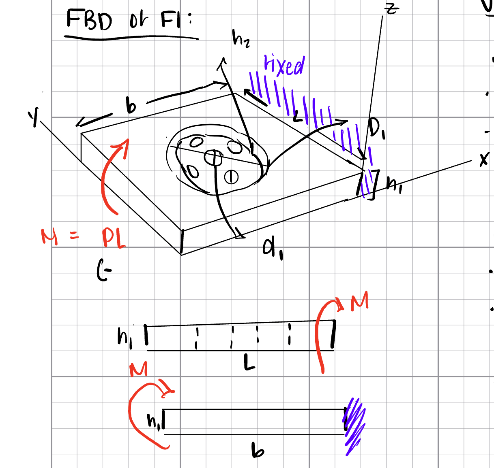

After this process, I made the design decision to model this part for PETG material, using values within the Ultimaker PETG data sheet. The maximum Youngs modulus and Yield Strength in the XY direction are used throughout both Feature 1 and Feature 2 are taken from this sheet.  
  
Once the feature had been visualized and labeled, the variables were assigned to dimensions provided through the motor specifications or assignment details. Next, assumptions were made and documented to simplify the calculations for this assignment. Within these assumptions, two assumptions were made for the height and length of the feature. To make these assumptions, I took into account the existing geometry of the motor, by designing under the length of the shaft and over the diameter of the Gearbox.   
  
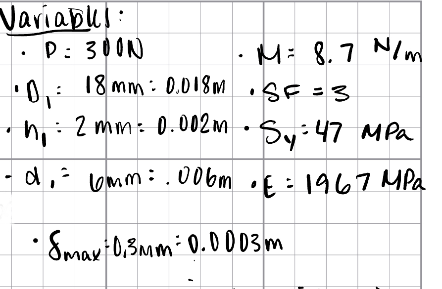 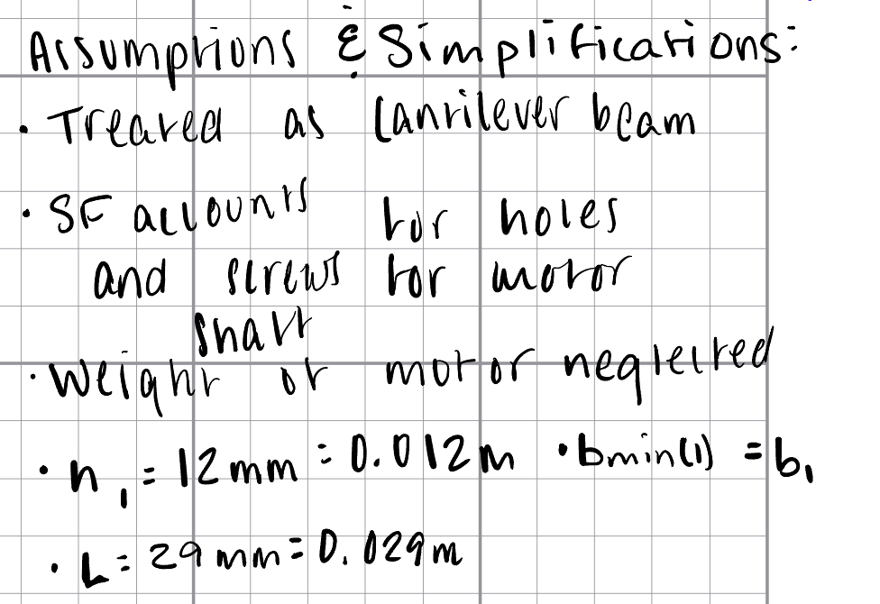  

Now that variables had been assigned values, I reflected on the beam bending equations for both stress and deflection gone over in the September 10, 2026 lecture. These are noted and derived as bstrength and bstiff. These equations are used in both features however, "bstrength" and "bstiff" act as variable names for the first feature within calculation and are denoted differently for Feature 2 for clarity. 
  
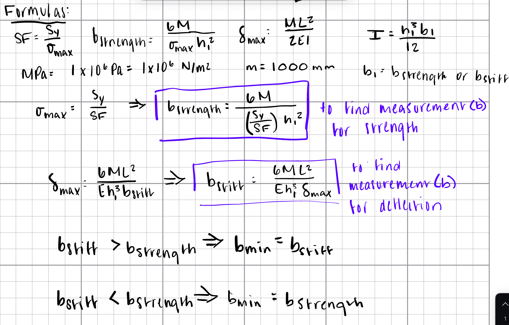  
  
*Seen Above: Within formula process, equations are algebraically solved to bstrength and bstiff*   
  
To determine which base distance will act as the design distance, all variables within the boxed equations were replaced with the appropriate value and solved.  
  
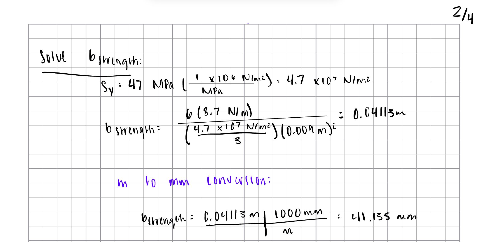 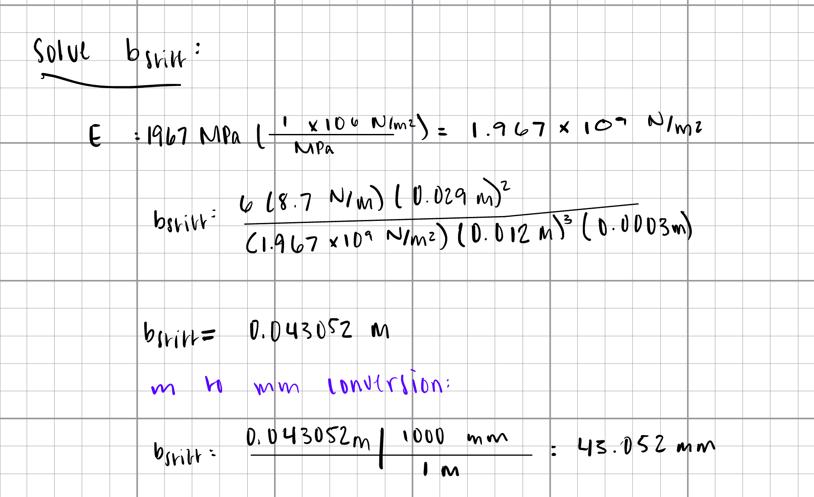  
  
Since in this case the base distance designed for distance was larger than the result for stiffness, it is the chosen length for this feature. (Labeled as bmin)  
  
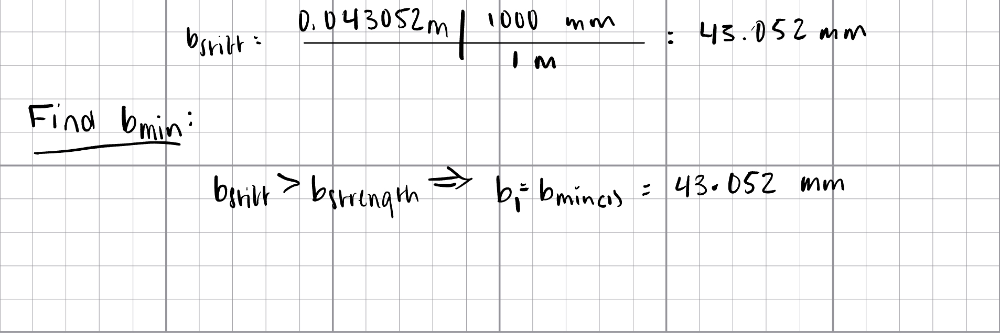  

## Feature 2  

I followed the same system of design for Feature 2, or the feature attached to the wall, beginning with the free body diagram. In the making of this diagram, I chose to label the length from the edge of the feature at which freedom to bend ends as b3. This sets the value up to be assumed as the moment needs to reflect the limited ability to bend. It also defined the Moment as in respect to this b3 length.
  
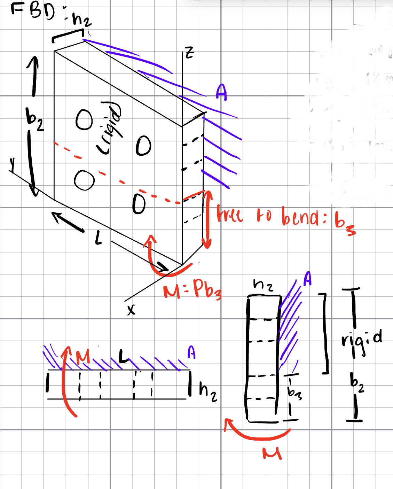  

Variables were assigned and most assumptions were applied to Feature 2 that had been applied to Feature 1. The previously mentioned b3 variable was chosen to be considerably under the length of Feature 1, as that is the closest reference length to variable b.  
  
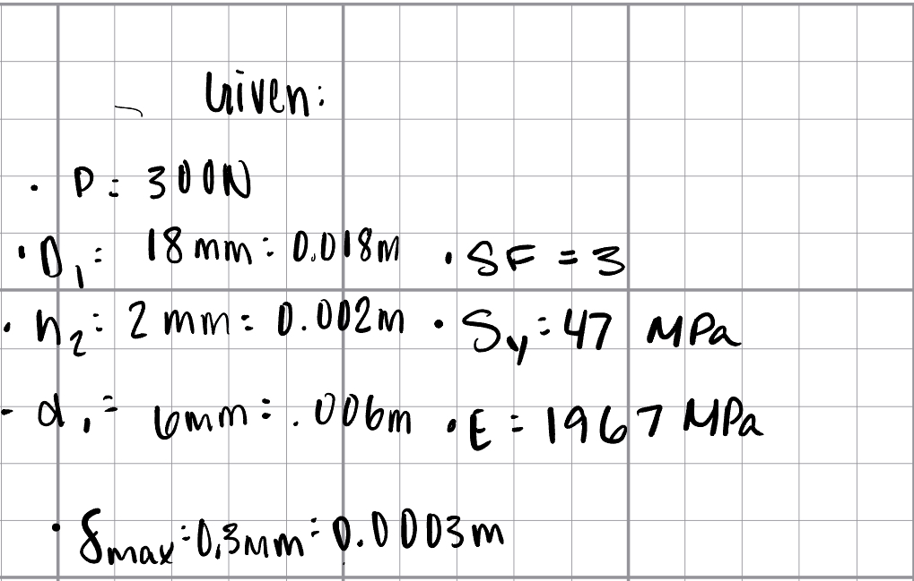 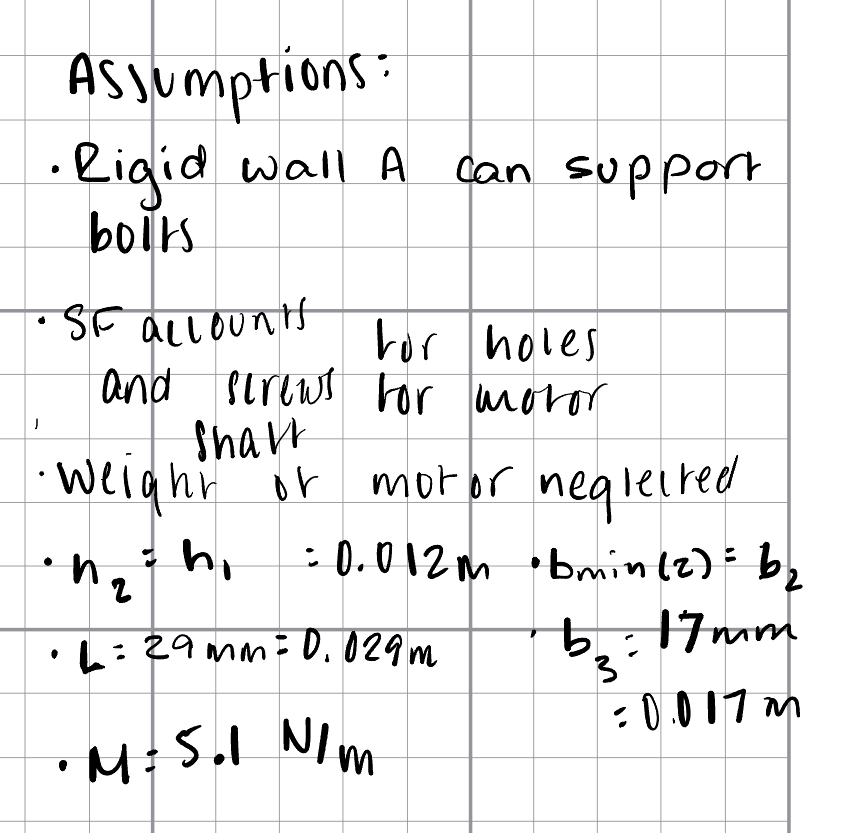  
  
The same formulas used for Feature 1 were then set up to algebraically solve bstrength(2) and bstiff(2). The highest numerical value found will then be assigned bmin(2).
  
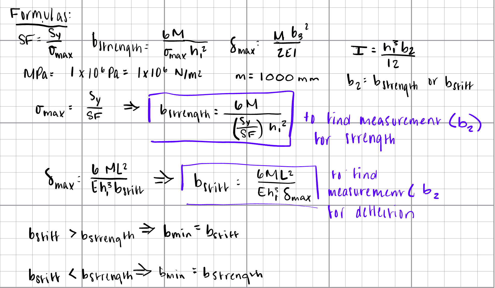  
  
Assumed and given values were then inputted in the above formulas and numerical values were found for both variables.  
   
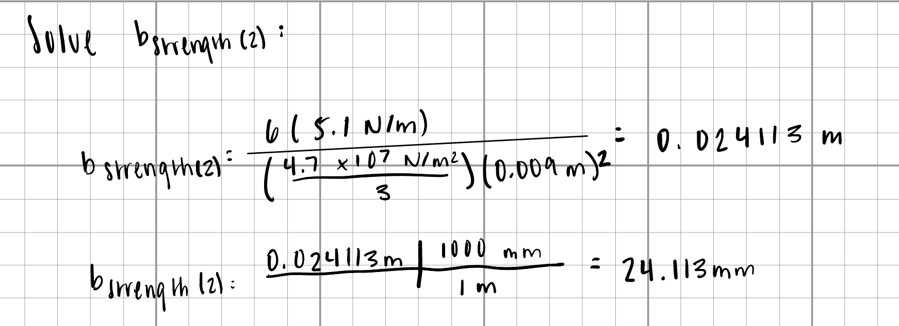  
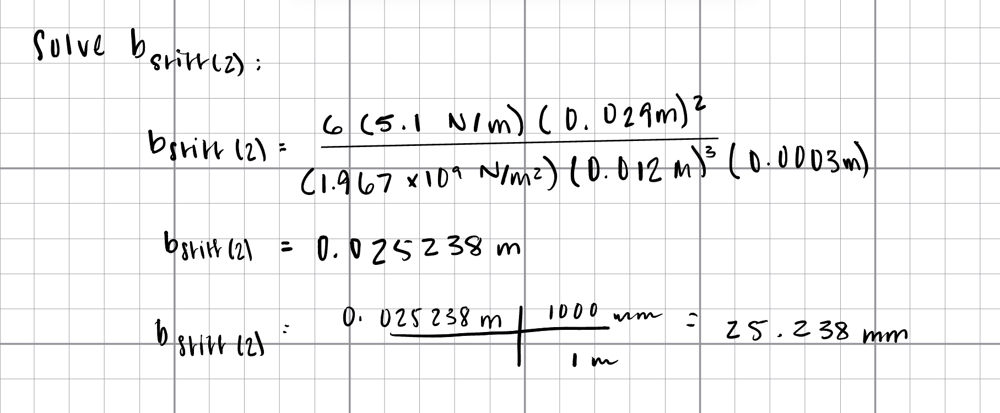  
  
Below is the resulting bmin(2) value, which will be used in design.  
  
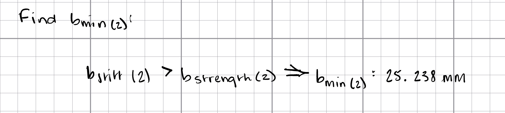  
  

  
## CAD Model 

To model this design, I used the variables and found b-value equations within the Equations property of the platform to begin parametric modeling. These dimensions were then used to create the basic geometry, extrudes, and cuts found in the part. For this assignment, distance between the wall mounting bolt holes must be chosen, and within this model I chose a 15.0 mm y-distance and a 16.0 mm x distance between each. Otherwise, all dimensions are assigned to those found in the design calculations.

  
**Visuals:**  
  
                          
  
  
## CAD and Paper Drawing

Closing out the assignment, I translated this 3D Model into a CAD drawing using a 1:1 scale and third angle projection. A paper sketch in isometric view is provided below as well.  

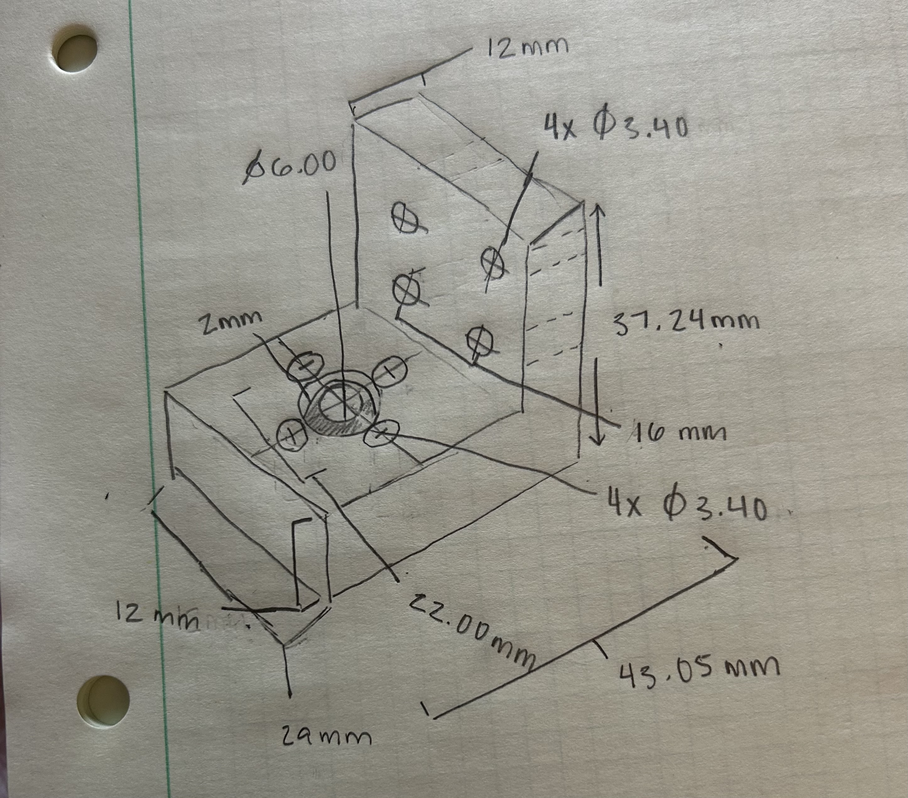 
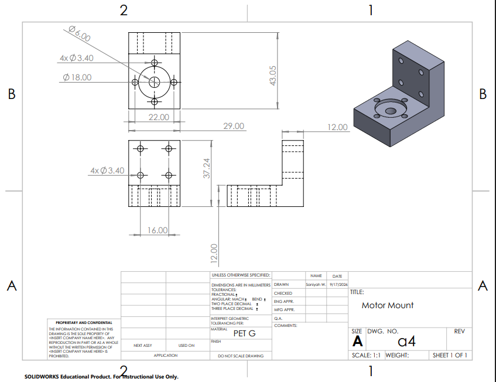 

## Lessons Learned
    
Through this assignment, I learned how to use maximum stress and deflection to design for strength and stiffness. Solving for those values taught me the importance of assigning variables early and remaining consistent with them. Further, the calculations themselves acted as a connector between specific values and how that presents in a part in the real world. I found the largest lesson of all to be this real world consideration, as some aspects of the features I did not think of realistically at first, and would change in the end.  
  
This assignment took me around 7.5 hours to complete.
  
## Download My Files  
  
Check out this link: https://drive.google.com/drive/folders/1P2uVFj1ZMD7Da951ZIxEp3W2Z7jV3CTM?usp=sharing
  
## Resources  

- https://www.additive-x.com/shop/media/mageplaza/product_attachments/attachment_file/u/l/ultimaker-petg-tds-v1.00.pdf
- https://www.omc-stepperonline.com/brushed-24v-dc-gear-motor-3-6kg-cm-46rpm-w-99-5-1-planetary-gearbox-pa28-28245800-g100
