# A5 – [Topic]

## Objectives
    
- Conduct stress analysis to determine appropriate dimensions for structural features.
- Generate free body diagrams (FBDs) to visualize forces and constraints for each feature.\
- Identify and document known and unknown variables, assumptions, and algebraic models for stress calculations.
- Perform stiffness analysis to establish minimum required dimensions based on deflection constraints.
- Compare stress and stiffness analyses to ensure structural integrity and compliance with given constraints.
- Create detailed multiview sketches illustrating dimensions derived from both stress and stiffness analyses.
- Reflect on and document key engineering lessons learned throughout the process
    
  
## Analyze
  
To begin the analysis for this bracket design, I began by documenting the concept design provided and other provided or decided base parameters which the design would be built off of. Within this concept design is the breakdown of features and measurements of the rigid T-beam that the bracket must affix to. I chose to use Titanium as the material for this project because I have not done so so far in this class.
  
 
  
**Stress Analysis**
  
To begin analyzing the bracket part, I drew a free-body diagram of Feature A, where I decided the length of the feature. To make this decision, I determined it would need to be larger than the width of the polyester strapping which is sized at 3/4". To find the reactionary force applied from Feature B and the minimum radius of the part the relationship between the Moment, yield strength and safety factor, normal stress, and Section Moduli are used to determine the appropriate formula. 

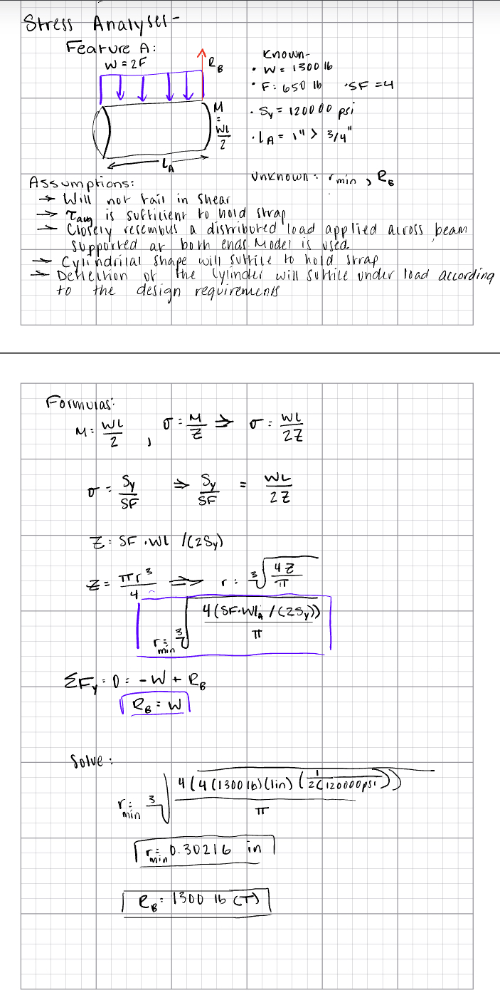 
  
Next, I analyzed the free-body diagram of Feature B, with the found force and reactionary force from Feature C in view. The diameter of Feature A directly determines the width of Feature B. For this part, I chose an overall length of 0.9" to attempt to keep proportional similarities with the concept design. To determine the thickness I used the relationship between the yield strength, safety factor, normal stress and area. To finish defining the part the reactionary force was determined.
  
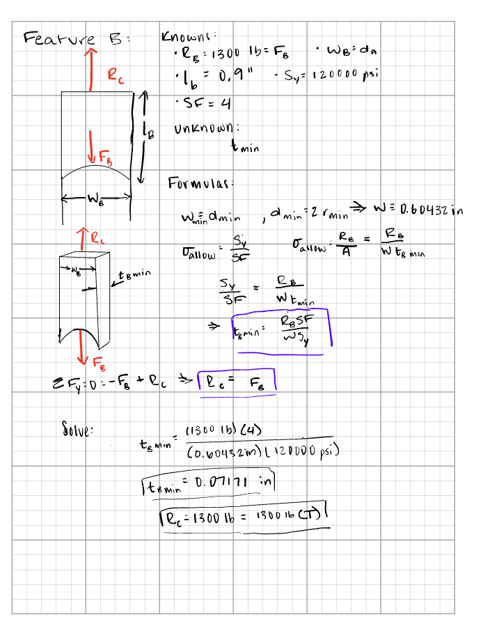 
  
The free body diagram of Feature C includes two reactionary forces from Feature D, due to the parts symmetry, and the force and moment of C itself . I chose to dimension the length at 1.3 inches. To define this feature, the moment and thickness about it must be determined. To do this, I began by finding the width of C as a sum of the dimensions provided for the rigid T beam. This measurement can then be used to compare the relationships between yield strength and the safety factor, the moment, the internal moment of inertia for a rectangular beam, and the Section Moduli to find the minimum thickness. 
  
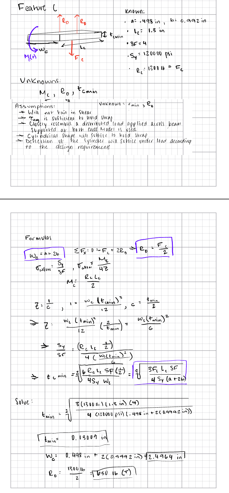 
  
Although the reactionary forces for Feature D exists in two places on Feature C, on the part itself, there is only one force caused by it with the other from the Feature E. The thickness is equivalent to the "c" measurement of the rigid T beam. The length is equivalent to the length of Feature C, leaving the only unknown values to be the Reaction E and the width. The relationship between normal stress, area and force, yield strength, and the safety are used to determine this length, while the static equilibrium equations suffice for the reaction. 
  
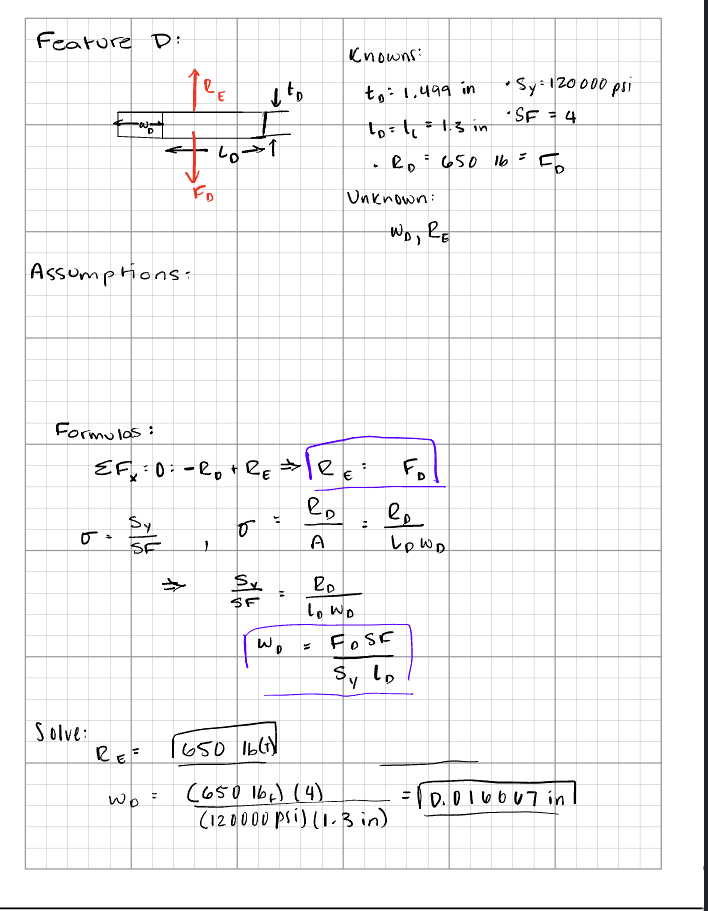 
  
On Feature E, there is only a moment and force acting on the part. This force has been predetermined and the length and width are found, leaving the thickness unknown. The relationship between moments, normal stress, and the Section Moduli are used to determine this unknown value. 
  
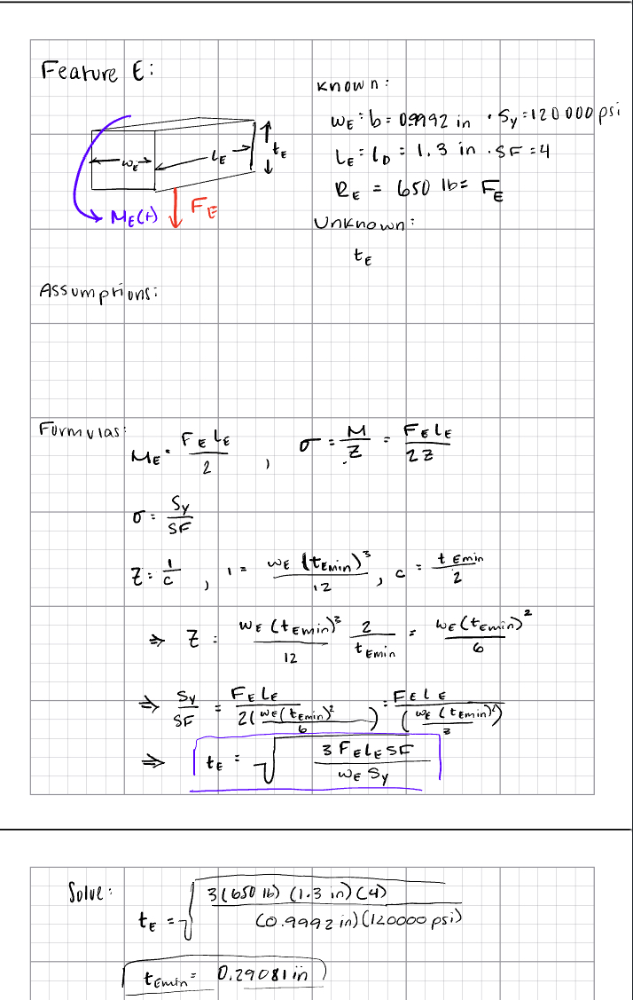 
  
**Stiffness Analysis**
  
To begin the stiffness analysis a similar process is used.
  
Again, I began with Feature A and translated any unaffected dimensions to to the FBD> The maximum deformation for a fixed beam with a uniform load is then used to find the minimum radius designed for strength.
  
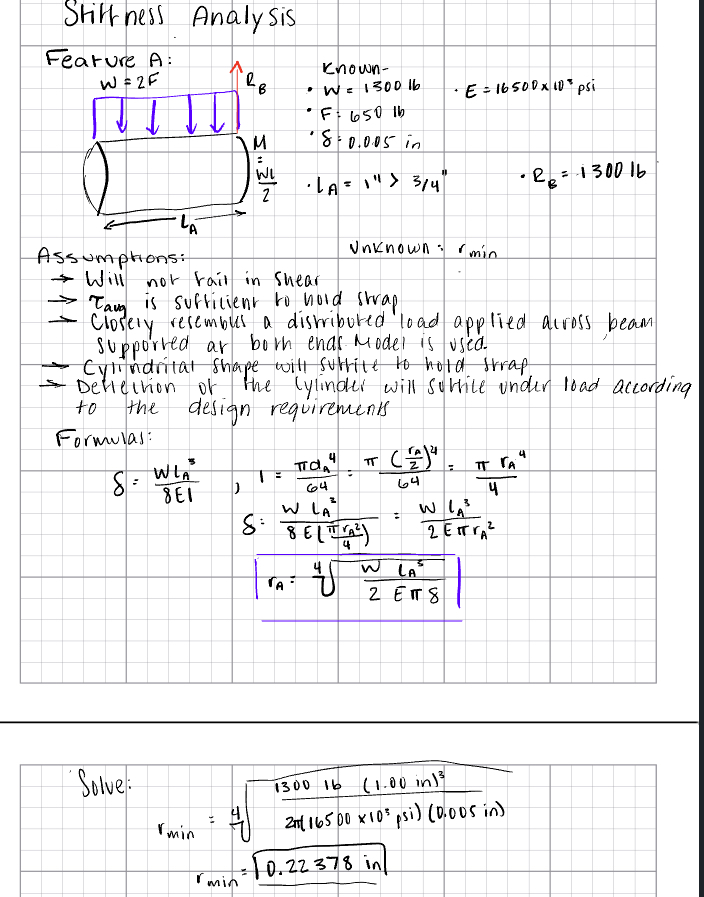 
  
For Feature B, calculations are more simplified and the basic relationship between force, length, the Youngs Modulus, and Area are used to determine the unknown thickness.
  
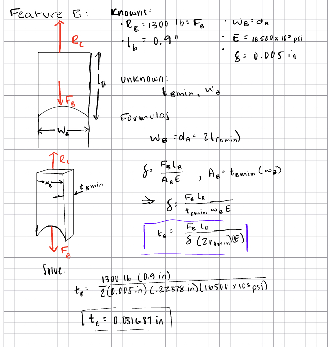 
  
In Feature C's calculations the beam is fixed at both ends so the corresponding maximum deformation formula is used with the rectangular shape of the feature kept in mind through the Moment of Inertia formula used.
  
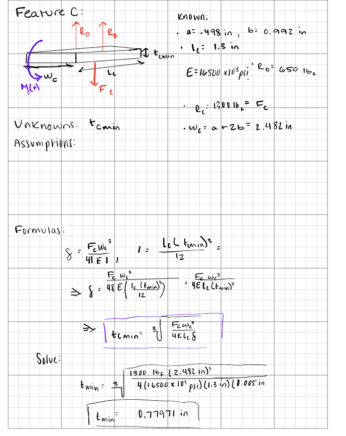 
  
Feature D has similar calculations to Feature B with the exception that the thickness is used rather than the length in the maximum deformation equation. This formula is used to determine the minimum width of the part.  
  
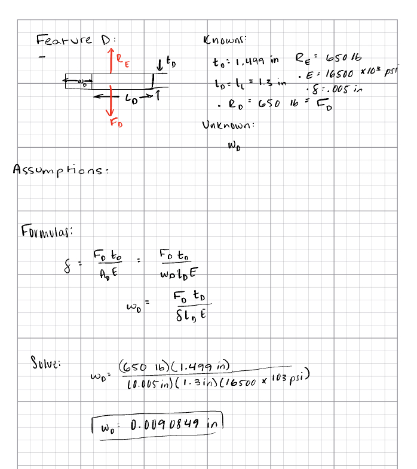 
  
To close out the analysis, Feature E is analyzed to find the minimum thickness using the maximum deformation and Moment of Inertia equations.   
  
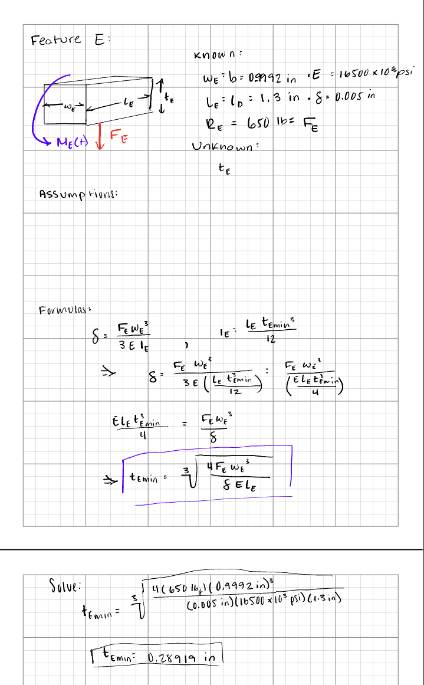 
  
## Multiview Sketches
  
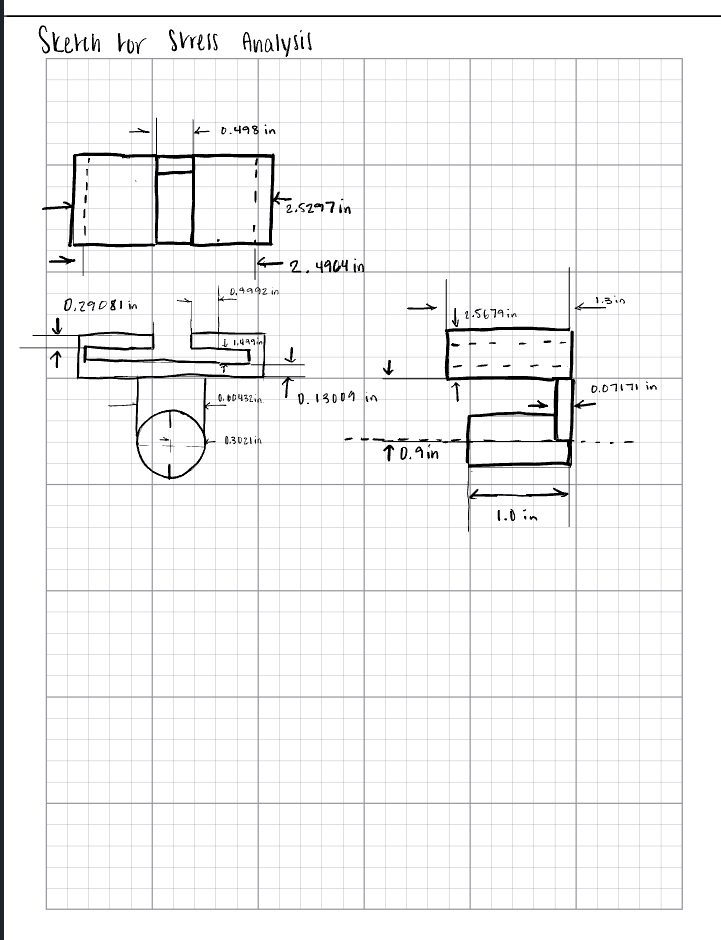 
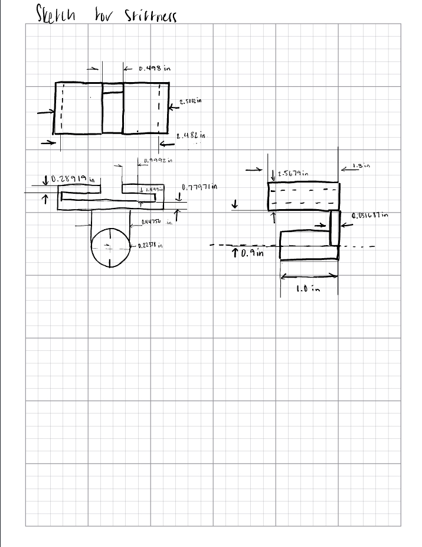

## Fits
  
To begin designing a link, I first translated the Linkage Concept to a FBD diagram which includes the overall force of the strap. I dimensioned the area of the design which has the least cross sectional area, based off found measurements from earlier analysis. For the fit of the link to Feature A, I determined from the machinery's handbook that to create a RC Fit a +0.0003 in allowance would need to be created. For the LT fit for the shaft an allowance of +0.0008 in is needed.  
  
   
(p.658)
  
(p.654-655)

 

Lastly, stiffness is verified.
 

## Communicate
  
Lessons Learned:  

