# A6 – [Topic]

## Parametric Design of Bracket
  
To begin modeling last weeks bracket design I began by creating a table of found values and identifying the highest of each for the components making up the part. For all except the thickness of part C, the values found for stress analysis were higher. Therefore, I used these highest values as my decided dimensions for parametric design.  
  
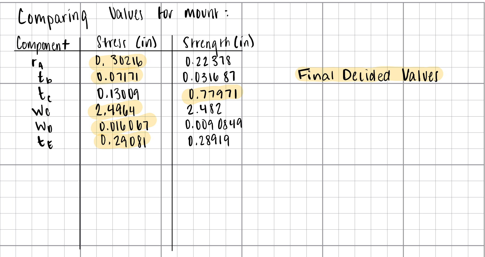  
  
I chose to isolate the global variables or parameters to my parametric equations to the needed values to find the designed dimension. If the value was either given through instruction, or would remain stable for any other reason, the value was directly assigned within this portal. Otherwise, the calculated dimensions were input using the formulas which were built to solve them.  
  
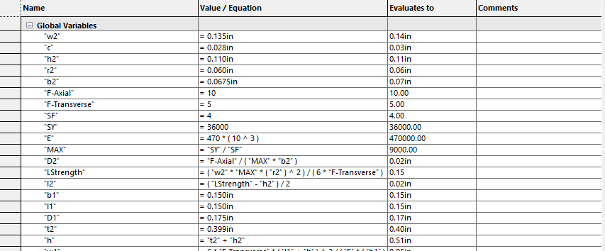 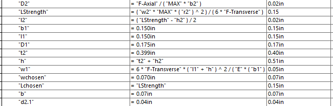  
  
After the parameters were defined, I began the base sketch of component A centered about the origin, making it easier to reflect symmetry in the part. Once extruded, I sketched and extruded component B off of the surface of component A.  
  
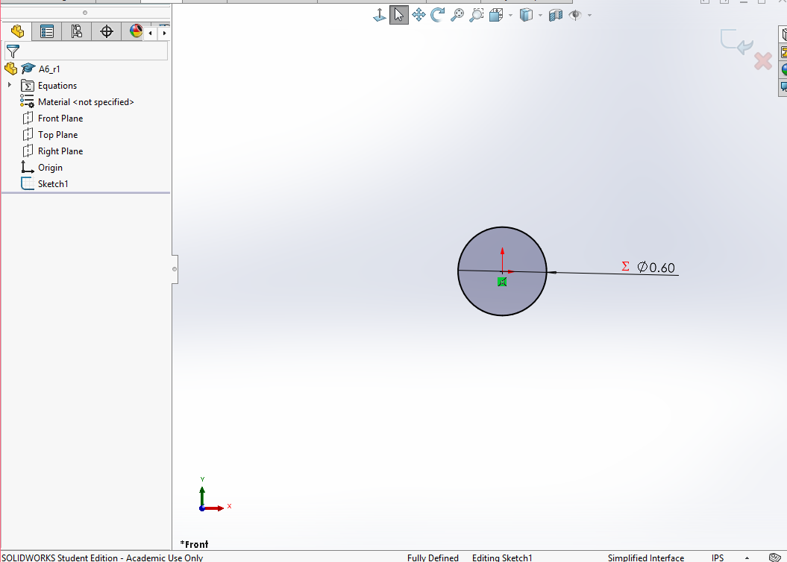  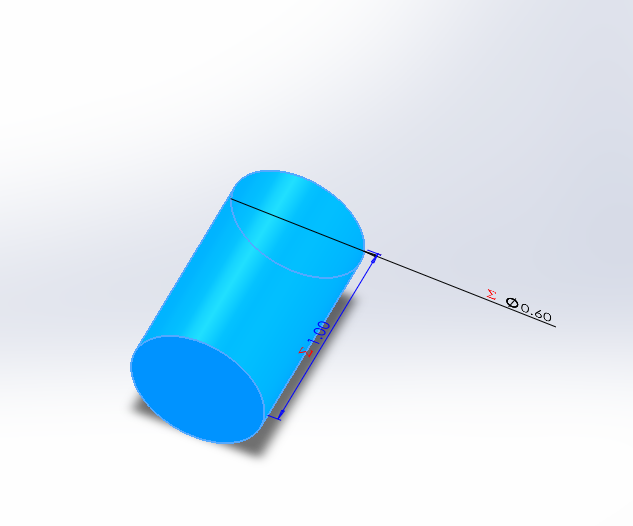 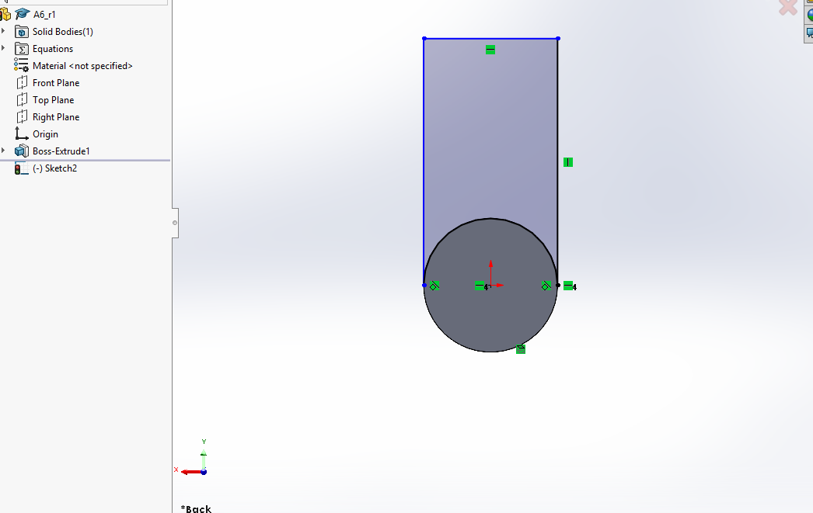  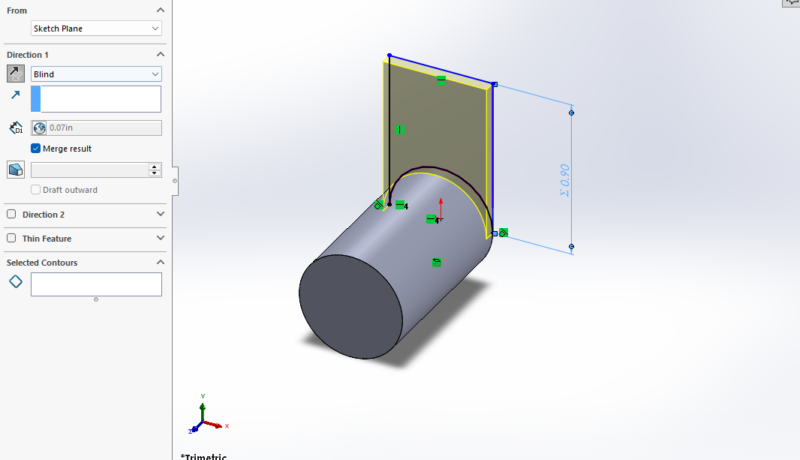  
  
At this point, it became clear that potential calculation errors would be simpler to identify with the parameters labeled before design. I corrected this at this point in the process.  
  
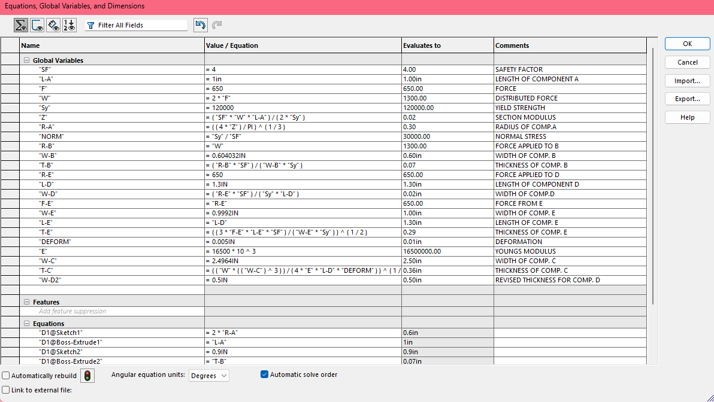  
 
Component C was sketched and extruded using parametric equation values as well. Prior parameter changes were helpful in finding an error in my choice for thickness of component D. The design was too thin in practice, and corrected through reassigning value to a new decided variable.   
  
  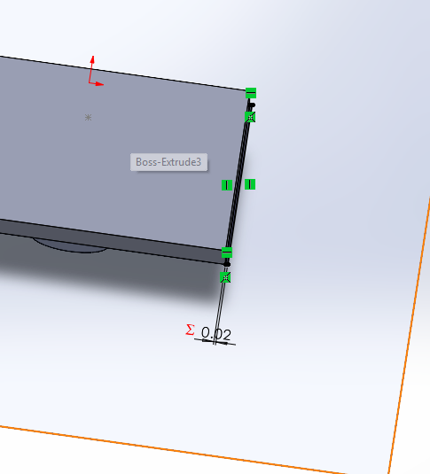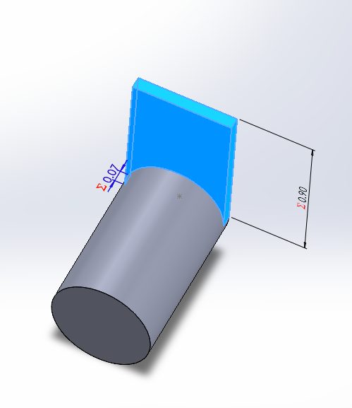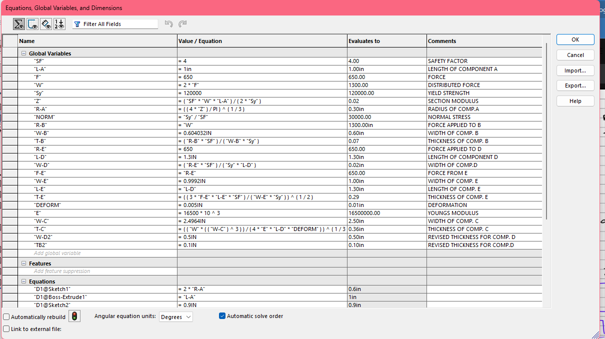 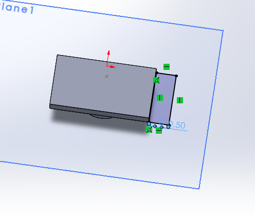  
  
The rest of the sketching process ran smoothly as the parametric equations automatically updated any design decisions when changed. To accommodate to the particular splitting of components present in my calculations, I added corner pieces to the design to finish the overall geometry.  
  
#### Visuals Past Modeling Component D 
  
 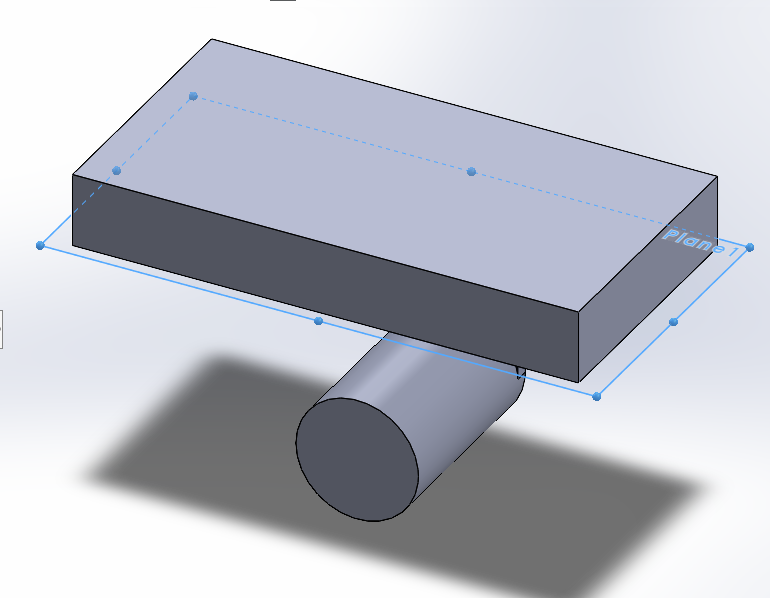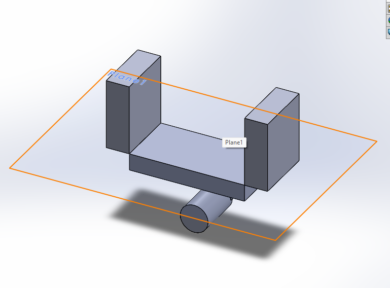 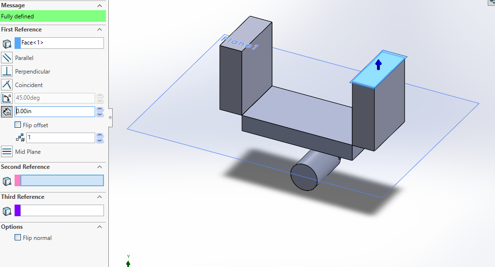
 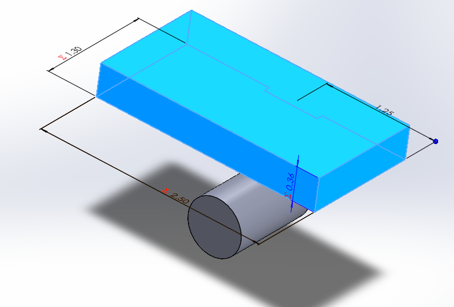  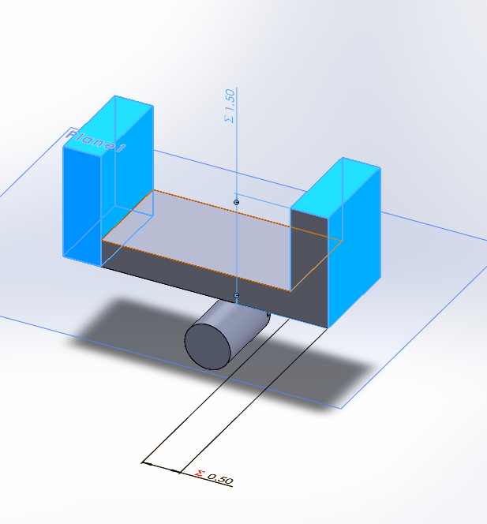 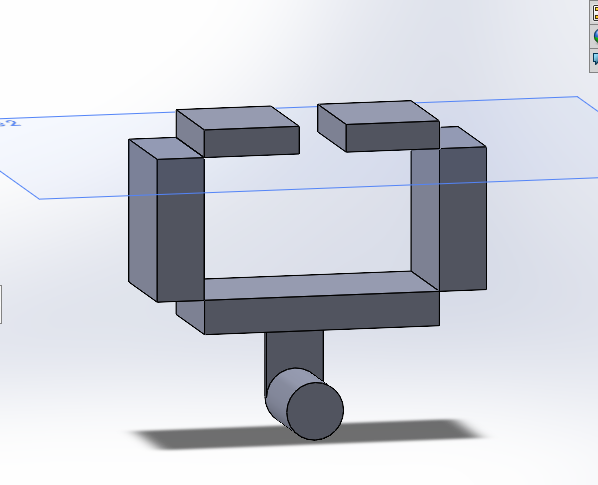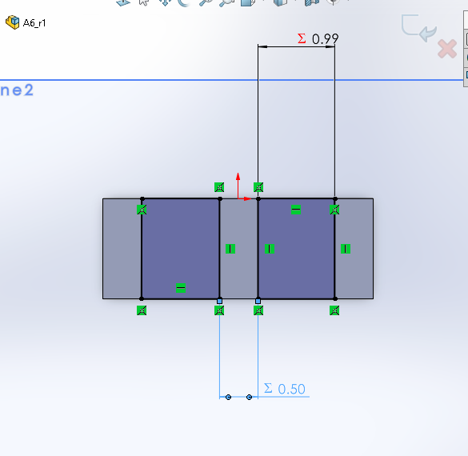 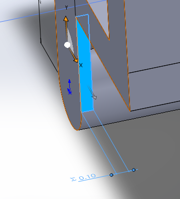   

## Bracket Drawing

To simplify the process of converting the Bracket CAD model into an ANSI drawing, I utilized SolidWorks automatic placement when Front View is drawn first to create the third angle projection required. To ensure all inner and diameters are clear, I chose a wireframe presentation. The dimensions and tolerances for the T-Beam were added in for this sketch as well.

 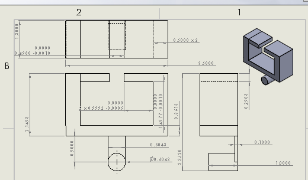   
 
## Linkage Model

The parametric design for the linkage model includes less equations than the bracket as the found values did not use as many values within their equations. All parameters were titled with the exception of the A-MIN value because I determined the value would not be needed in the model.

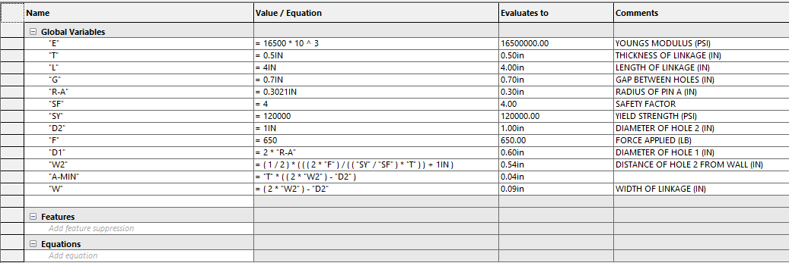 

The modeling process for this part was very similar to the bracket. Some previously assumed design decisions worked poorly in practice, and did not leave enough room for the holes, such as the width. This was corrected for the final product before drawing.

#### Linkage Model Visuals
    
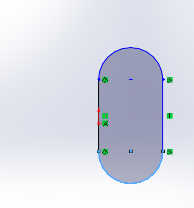  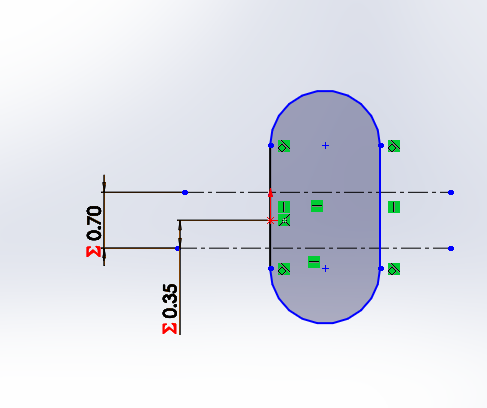 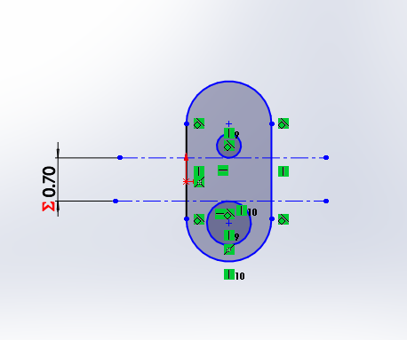 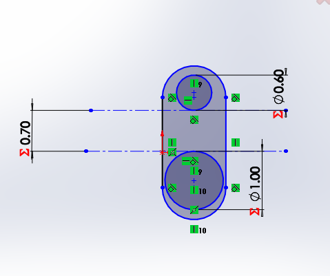 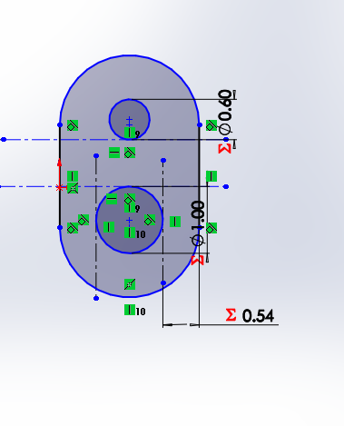 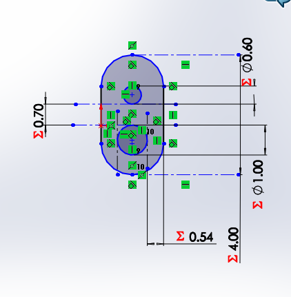 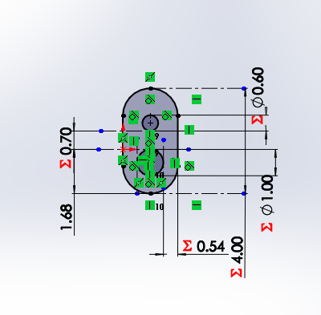 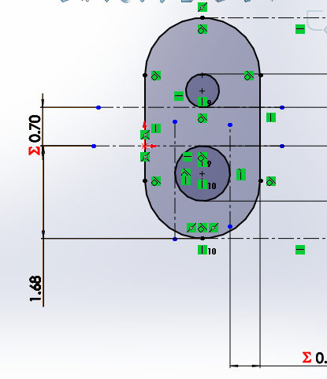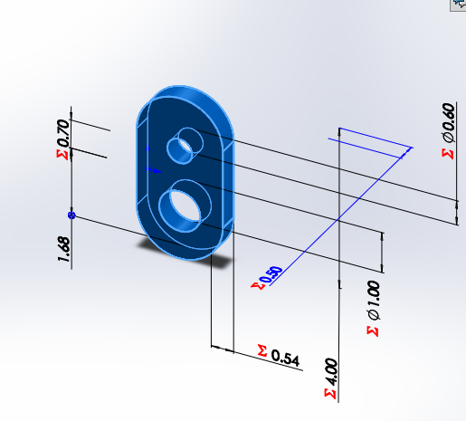  
  
## Linkage Drawing
  
To produce the CAD drawing for the linkage part I followed a third angle projection layout and the ASME Y14.5 standards requested for the assignment. Unique edits for this goal included the addition of geometric dimensioning which include the range of clearance based on diameter. Additional information regarding design, including a small note identifying the ideal fit between the link and bracket, was added to complete the drawing.  
  
**  
  
## Communicate
  
#### Reflections  
  
Through this assignment I learned that the tolerance and clearance of a part directly determines the specific part to part compatibility found between two parts. To accurately design parts which are mated together, it is important to always consider clearance, to reflect true part behavior. Without sliding clearance for the Linkage, the designed Bracket would not be held onto the structure.  
  
This assignment took around 6-7 hours to complete.  
    
#### Resources  
  
- Machinery's Handbook
- https://www.gdandtbasics.com/asme-y14-5-gdt-standard/
- https://www.uline.com/Product/Detail/S-12925/Poly-Cord-Strapping/Heavy-Duty-Polyester-Cord-Strapping-3-4-x-2500?pricode=WA9239&gadtype=pla&id=S-12925
  
  
#### Download my Design!  
  
https://drive.google.com/drive/folders/1XThdRpNLSdnRcVv3-v0Qht5zKoc8IsnA?usp=sharing
